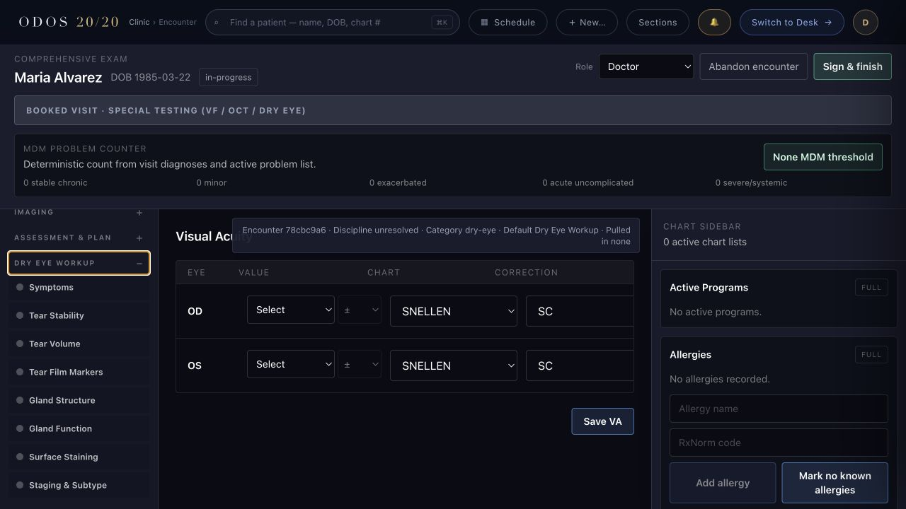
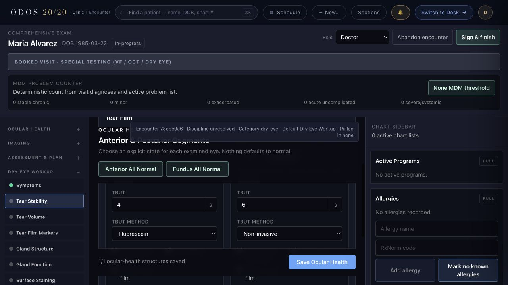
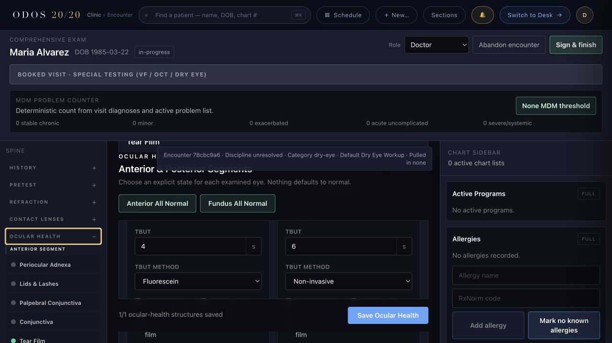
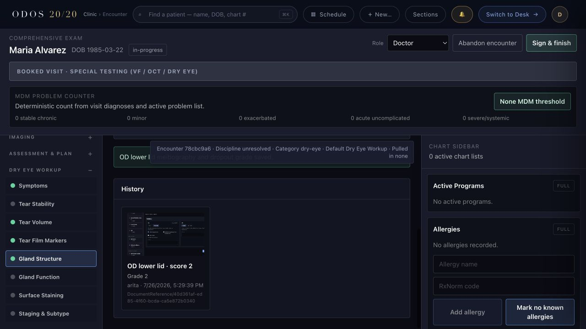
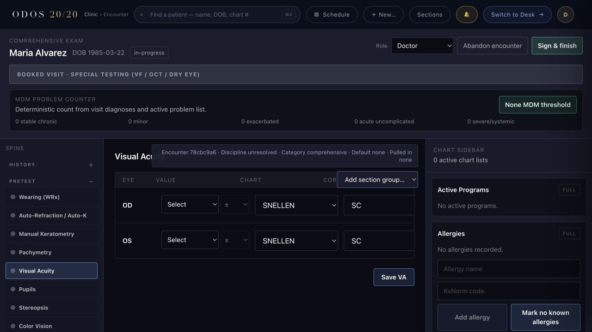

# Dry-Eye Battery Live Synthetic Proof

Captured from the local self-hosted synthetic stack on 2026-07-26 at PR head
`199f58cfab5744ce821ded97ca0a1b7cc434aeb4`. The patient, appointment, encounter,
measurements, and uploaded image are synthetic.

Each screenshot includes the chart provenance strip in-frame. The dry-eye images show:

- Encounter `78cbc9a6-8a54-44a6-b0fe-5a05869474f9`
- visit-type category `dry-eye`
- default section group `Dry Eye Workup`
- no encounter-level pull-in

The comprehensive control temporarily resolved the same synthetic encounter as category
`comprehensive`, captured `Default none · Pulled in none`, and then restored the visit
type to `dry-eye`. This isolates category-based visibility without changing the
encounter's synthetic clinical data.

## Evidence

### Exact eight-section battery

### Shared TBUT stable key and history

The first view reaches Tear Film through the Dry Eye Workup alias. The second reaches
the routine Ocular Health Tear Film row. Both show the same encounter and the same OD/OS
values and methods.

### Meibography image, score, and dropout-grade readback

### Comprehensive-category exclusion with Pupils retained

