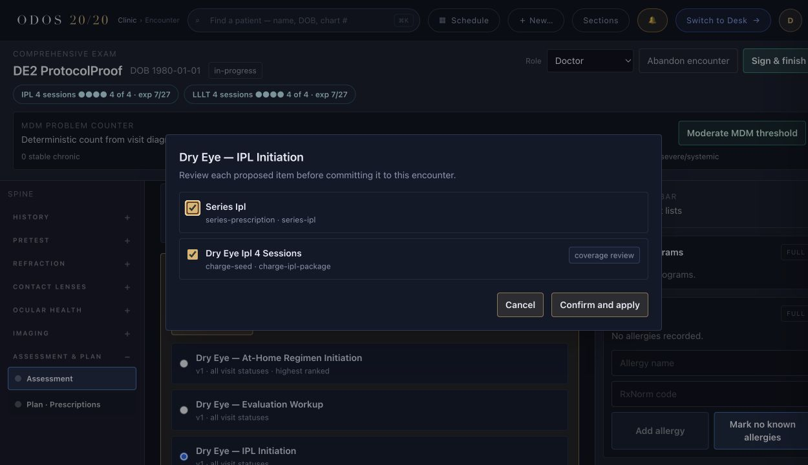
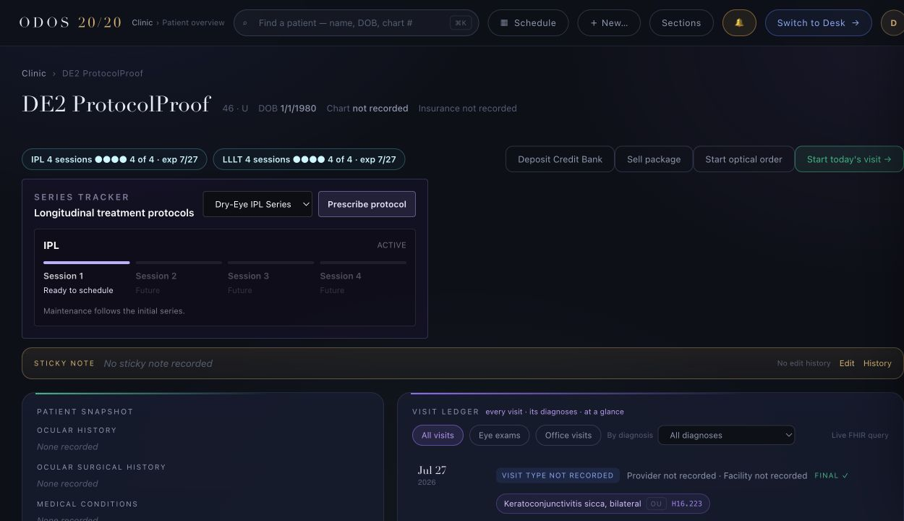
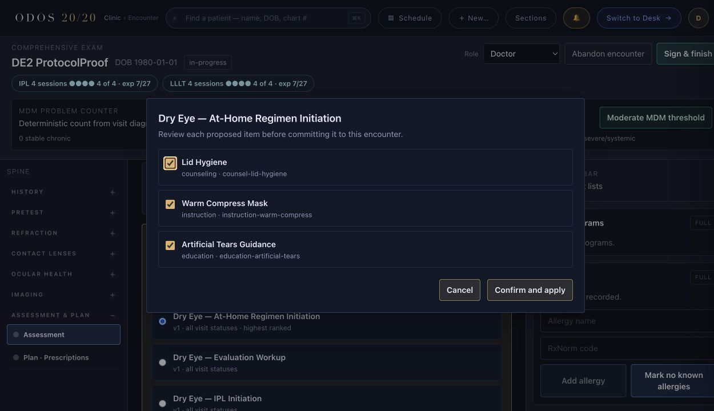
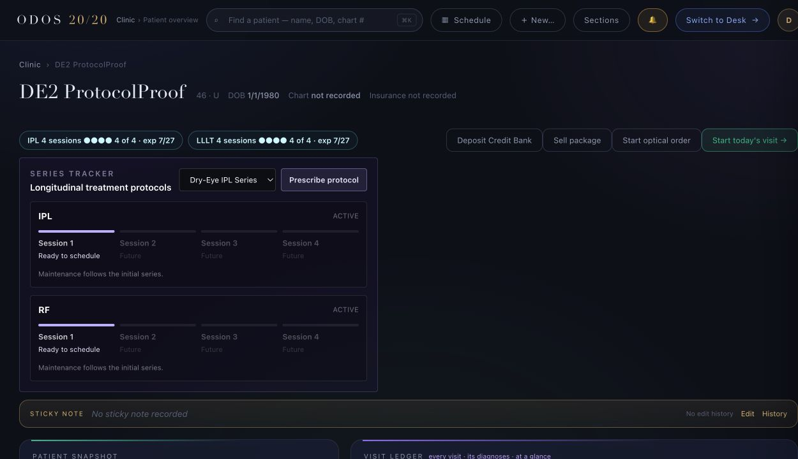
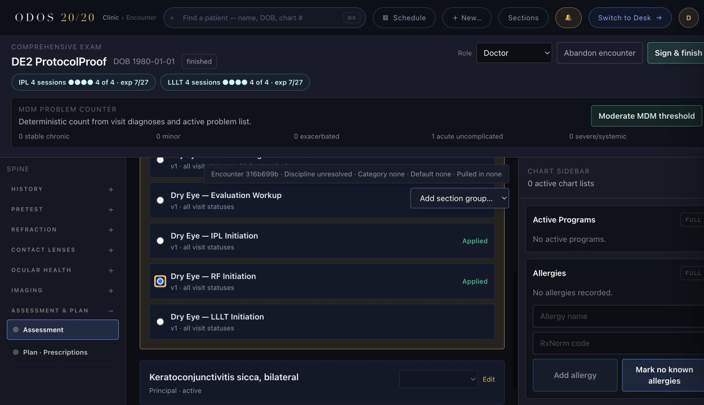
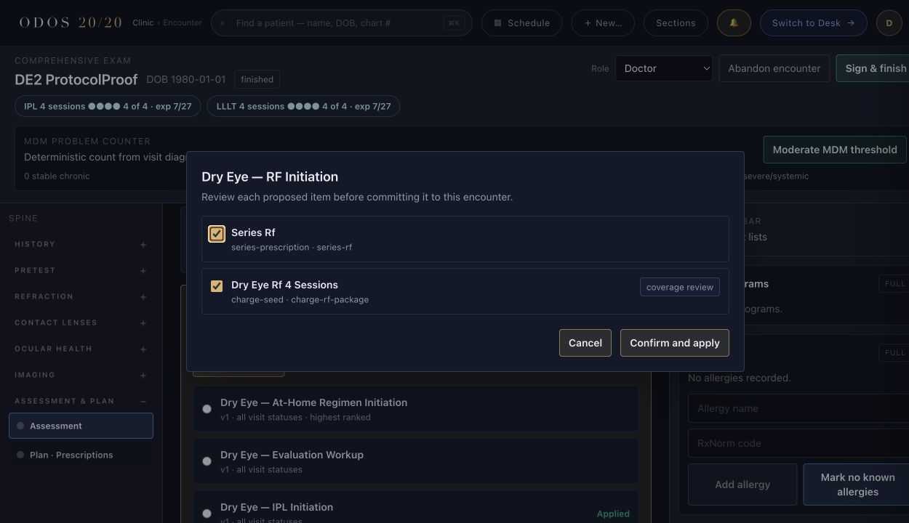

# Dry-eye initiation fix-back browser proof

Captured on the local synthetic stack against patient `DE2 ProtocolProof`. No real patient data appears in these artifacts.

## Required proof

### IPL initiation proposal

Encounter `b4c3a02c…` shows the `Dry Eye — IPL Initiation` staging sheet with both canonical items selected:

- `series-prescription · series-ipl`
- `charge-seed · charge-ipl-package`

### IPL series tracker

The patient overview shows one active IPL series with four session slots. This is the allowed pre-first-session proof option: the tracker cannot render the stored 21–28-day interval until a completed session establishes the next-session due window, so it correctly displays `Ready to schedule`.

### At-home regimen proposal

Encounter `b4c3a02c…` shows only lid-hygiene counseling, warm-compress instruction, and artificial-tears education. No series prescription or charge seed is present.

### Combined IPL and RF visit

Encounter `316b699b…` has both `Dry Eye — IPL Initiation` and `Dry Eye — RF Initiation` applied independently. The patient tracker then shows two separate four-session series, with no combined series.

## Combined-visit supporting frames

The chart frame supplies the source encounter provenance and visibly shows both protocols as applied:

The RF staging frame shows its independent series item and four-session package charge seed while IPL is already applied on the same encounter:

The live FHIR check for encounter `316b699b…` found two independently scoped staged charge proposals: `dry-eye-ipl-4-sessions` and `dry-eye-rf-4-sessions`. The current UI has no single surface that displays the encounter identifier, both charge proposals, and both tracker timelines simultaneously; the supporting chart and staging frames preserve that provenance without altering the UI for this evidence-only fix-back.

## Sealed bundle

### Summary

- Series-prescription selections now reject any submitted payload that differs from the canonical protocol item.
- Charge-seed selections now follow the same canonical-payload rule, preventing client substitution of procedure or coverage-rule keys.
- The canonical payload is used for definition lookup and commit, pinning `seriesProtocolId`, `chargeSeedRef`, omissions, extra fields, and future payload fields together.
- A missing service FHIR client now returns a structured `500` response with a diagnostic message.
- LLLT initiation now has end-to-end CarePlan, four-session, and package-charge coverage.
- Re-applying after un-apply restores the conditionally matched revoked CarePlan to active without discarding completed-session activity.
- Direct modified-charge staging records the canonical payload, changed fields, and clinician-entered provenance.

Rejecting mismatches was chosen instead of silently ignoring them because ordinary protocol items intentionally support clinician payload overrides, while a series prescription's linkage and charge fields are binding prescription data. A `400` makes an altered series request explicit and auditable.

### Files touched

- `mcp/src/clinical-graph/protocol-endpoint.ts`
- `mcp/src/clinical-graph/protocol-service.ts`
- `mcp/src/clinical-graph/protocol-types.ts`
- `mcp/tests/dryEyeInitiationProtocols.test.ts`
- `mcp/tests/searchParamContract.test.ts`
- this README and the six synthetic browser-proof images in this directory

The protected files remain byte-identical to `origin/main`:

- `mcp/src/series-tracker/series-care-plan.ts`
- `mcp/src/series-tracker/series-tracker-endpoint.ts`
- `mcp/src/commercial-engine/*`

`mcp/src/clinical-graph/protocol-service.ts` was intentionally in scope for the second fix-back's charge-provenance repair.

### Checks run

- `cd mcp && npx tsc --noEmit` — exit 0, no output
- `cd mcp && npm test` — 2,514 total / 2,469 pass / 45 skipped / 0 fail
- focused dry-eye plus search-contract tests — 19 total / 19 pass / 0 fail
- `cd ui && npx tsc --noEmit` — exit 0, no output
- `cd ui && npm test` — 556 total / 556 pass / 0 fail on the prior fix-back; skipped this round because no `ui/` file changed and CI covers it
- `npm run preflight` — 0 warnings / 0 hard blocks
- `git diff --check` — exit 0, no output

The required regression test was run against the pre-fix code first: 11 total / 9 pass / 2 fail. The payload-swap case returned `200` instead of the expected `400`, and the missing-service-client case escaped as the bare error `Protocol series prescriptions require the service FHIR client.` The fixed focused run passed 11/11.

The second fix-back's three tests were also run before implementation: 14 total / 11 pass / 3 fail. Re-apply left the CarePlan `revoked` instead of `active`; the RF charge payload swap returned `200` instead of `400`; and the modified charge reported `protocol-default` instead of `clinician-entered`.

### Risks and follow-ups

- The first-session interval proof uses the allowed pre-session option described above.
- A proof-only un-apply/re-apply sequence exposed a defect introduced by this PR's conditional CarePlan create: it reused a revoked series without restoring it to the active tracker. The second fix-back now restores a matched revoked CarePlan to active while preserving its activity and signed-session history.
- The generic materialization flag, package-catalog linkage, multi-diagnosis ranking, and eye-care-versus-aesthetics settings presentation remain explicitly out of scope.
- No new medical code was added, no Mandate 14 ledger row was required, and no decision/INDEX update was required.

### Patch and status

The patch is committed on `drbang-iva/dry-eye-init` for PR #245. No separate patch-application command is needed.

**Status: NEEDS REVIEW.** The prior independent review covered head `6f0159a`; this fix-back changes the head and must receive a fresh independent Fable/Opus evaluation before merge. Codex authored the fix-back and cannot evaluate it.
