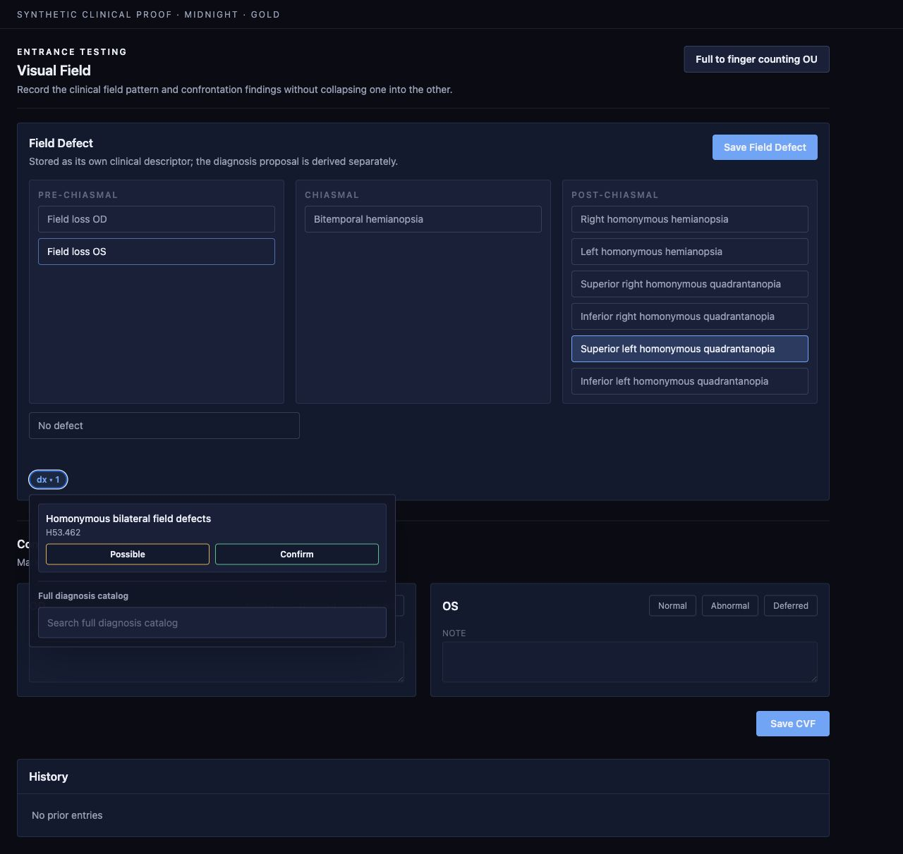
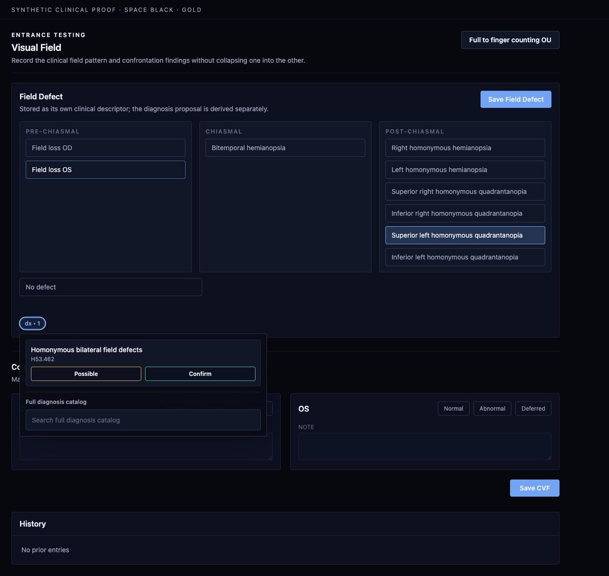
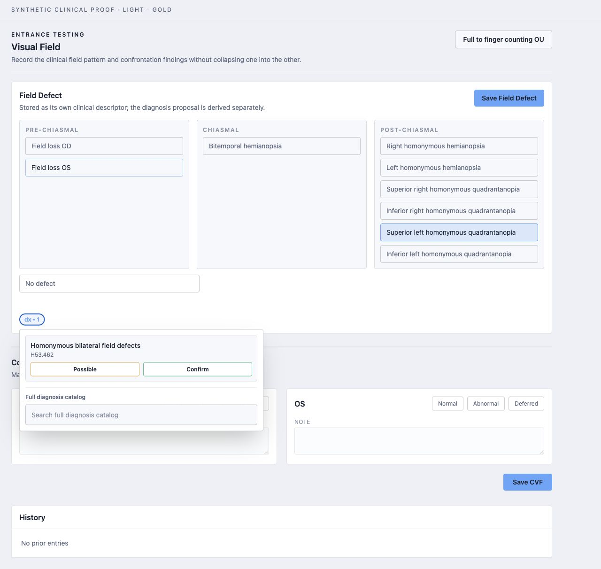

# Visual Field rendered proof

Captured on 2026-08-05 from the local ODOS UI with synthetic patient and encounter references. No PHI or credentials are present.

The proof reloads the stored descriptor `Superior left homonymous quadrantanopia`, keeps that descriptor visibly selected, and expands its separately derived diagnosis proposal `H53.462`. The same clinical section was rendered with each defined surface while retaining the gold accent.

## Midnight

## Space Black

## Light

