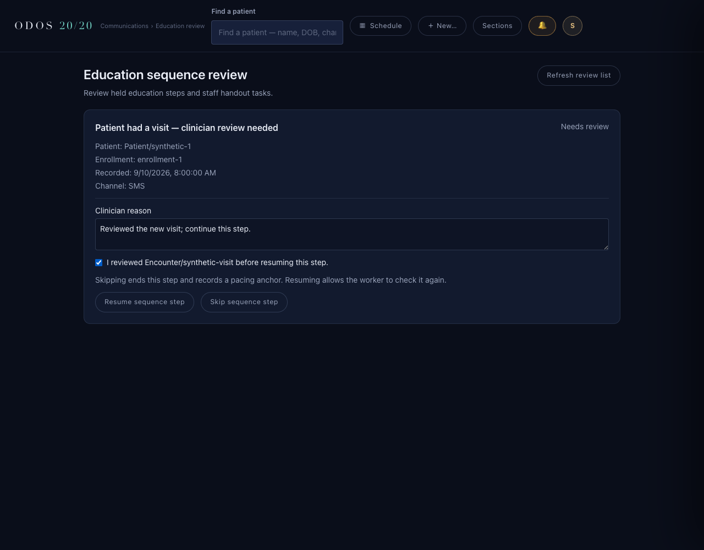
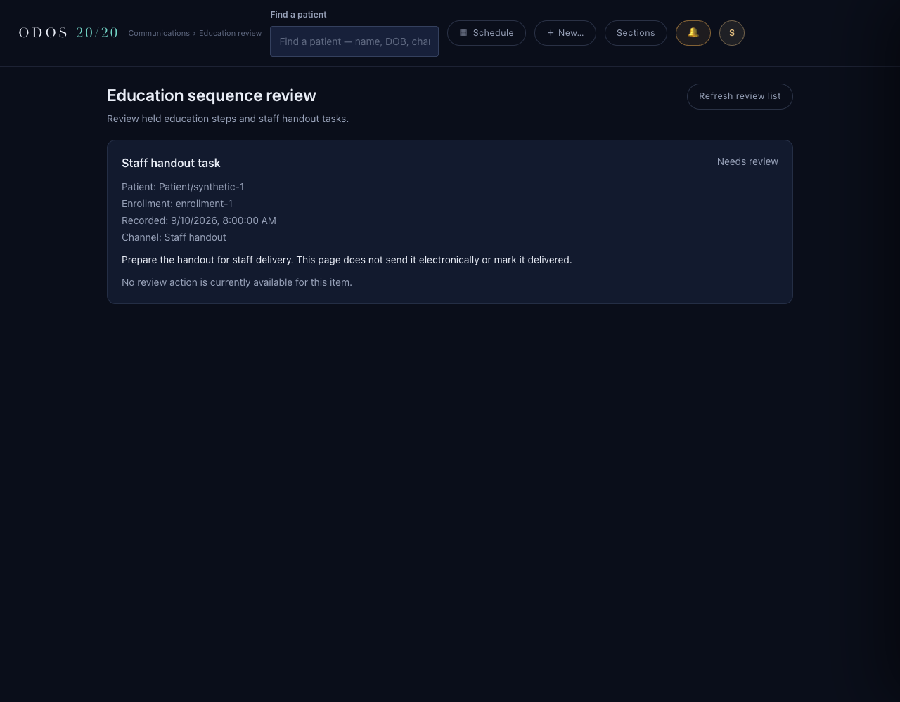

# SEQ-2 staff review UI — author evidence

Base: `cf3a4f0a`. Branch: `drbang-iva/seq2-review-ui`.

The Sections drawer exposes **Education review**, routed through the existing
`RouteSwitch` at `/communications/education/review`. The page lists open and settled
staff work, identifies patient/enrollment references, explains handout tasks, and
uses the server's `allowedActions` to show eligible review controls only to provider
roles. Missing capabilities or a missing enrollment version leave items read-only.

Clinician reasons are required. Resuming a patient-seen row additionally requires
explicit review of the exact Encounter reference carried by that work item. Writes
send its expected version. Backend failures remain visible (including typed 409
refusals) and block further actions until the list is refreshed. A successful skip
explicitly does not claim delivery. The page never performs an electronic send.

The existing `/communications` Vite proxy intercepted document navigation to this
new page. An exact-path, document-only bypass now serves the SPA for this one route.
The browser test confirms JSON requests to that path and HTML requests to a sibling
path still reach the backend. No blanket HTML or route-prefix bypass was added.

## Files

- `ui/src/App.tsx`: exact route and provider-role display capability.
- `ui/src/components/AppShell.tsx`: Sections link and breadcrumb.
- `ui/src/lib/communications-client.ts`: existing token/fetch pattern, queue DTO,
  boundary validation and typed refusal handling.
- `ui/src/scenes/EducationSequenceReview.tsx`: review list and clinician controls.
- `ui/vite.config.ts`: exact document route bypass.
- `ui/tests/educationSequenceReview.test.tsx`: Chromium route/interaction proof.
- This evidence and the two synthetic screenshots.

## Executed checks and output

From the isolated worktree `ui/`:

```sh
npm ci --ignore-scripts
```

Exit 0: `added 150 packages, and audited 151 packages in 637ms`; `found 0 vulnerabilities`.
No dependency or lockfile changes.

```sh
npm exec -- tsx --test tests/educationSequenceReview.test.tsx
```

- Pre-implementation RED: exit 1, tests 5 / pass 0 / fail 5 / skipped 0.
  Direct document navigation returned **404 rather than 200**; subsequent controls
  could not be reached. These were real browser requests through the Vite proxy.
- Initial GREEN: exit 0, tests 5 / pass 5 / fail 0 / skipped 0.
- Extended capability and exact-proxy checks GREEN: exit 0,
  tests 6 / pass 6 / fail 0 / skipped 0 (five subtests plus their parent test).
- Mandate 17 mutation: removed the resume button's patient-seen Encounter-confirmation
  disabled condition. The browser observed the button enabled before confirmation:
  `patient-seen resume requires explicit review of the held encounter`,
  `false !== true`. Exit 1, tests 6 / pass 4 / fail 2 / skipped 0
  (the intended subtest and its parent failed).
- Restored GREEN: exit 0, tests 6 / pass 6 / fail 0 / skipped 0.

The first mutation run also exposed a cumulative fixture assertion in the handout
subtest: it expected the first subtest to have completed its POST. That assertion was
changed to compare POST count before/after the handout interaction itself, and the
same production mutation was rerun to produce the isolated failure counts above.

```sh
EDUCATION_REVIEW_CAPTURE=/tmp/odos-seq2-review-ui/docs/build-log/education-seq-2/review-ui.png npm exec -- tsx --test tests/educationSequenceReview.test.tsx tests/appShell.test.tsx tests/roleRouting.test.tsx tests/clinicalGraphRouting.test.tsx tests/engageSheet.test.tsx
```

Exit 0: tests **62 / pass 62 / fail 0 / skipped 0**. Final screenshot-only capture
refinement (disable transitions during capture) was followed by another focused run:
exit 0, tests **6 / pass 6 / fail 0 / skipped 0**.

```sh
npm exec -- tsc --noEmit --skipLibCheck
```

Exit 0, no diagnostics (run twice).

## Browser evidence and limits

The test runs real `AppShell`, `RouteSwitch`, page, communications client, and normal
Vite configuration with a disposable loopback HTTP backend. Fixtures are synthetic
and permissive; the backend fixture does not enforce clinician reasons or encounter
review. Thus the browser assertions test UI controls rather than fixture enforcement.

This is routed UI/client/proxy proof, **not real Medplum AccessPolicy or production
backend authorization proof**. The authenticated App bootstrap is not exercised;
the test supplies synthetic role props directly to the real routing components. The
backend remains authoritative for permissions, current enrollment eligibility,
version preconditions, and allowed actions. Backend integration is a separate agent's
change and must be validated after integration.

Both screenshots were opened and visually checked. Only synthetic references appear.





No clinical terminology assertions, new strategy decisions, or Mandate 14 ledger
changes. No PR, push, merge, or self-evaluation.

Status: implemented with author evidence; needs independent evaluation.
