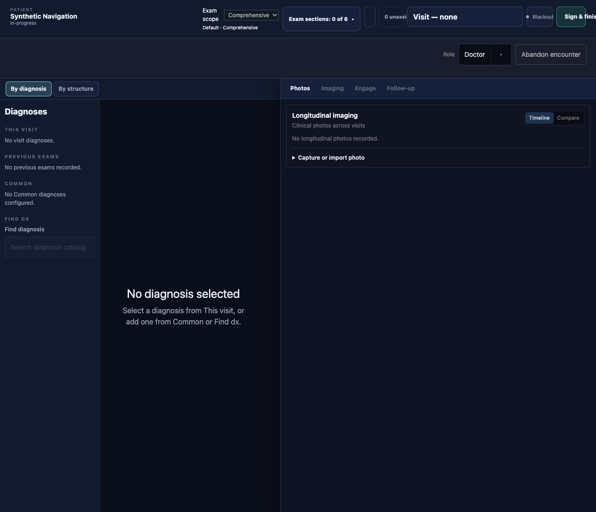
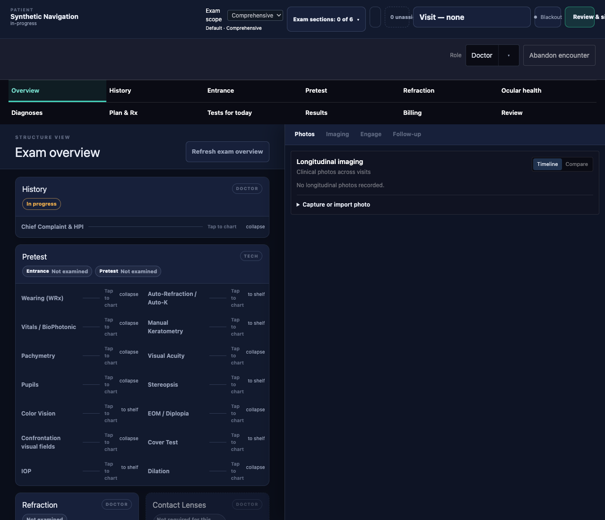

# N1 — persistent exam navigation

NOT EVALUATED

Status: needs-review — independent HUB evaluation pending.

Coded-by: Codex — GPT-5.6 Sol, high effort

The exam now has a persistent two-row menu. Doctor opens on Overview, Tech on Pretest, and an explicit `exam` address value takes precedence. Menu moves replace that address value; StartExam uses the existing openEncounter helper so the visit itself is reloadable. The header opens Review, and only Review invokes the existing signing path.

Branch: `drbang-iva/exam-nav-n1-menu`. Pinned base: `cd05d5c94062212d38e23cc74ee8c9844fad0b6a`. The later W1 main advance changes none of N1’s cited files; the implementation retains the pinned base. This is author proof, not an independent verdict or live deployment proof.

## Files and purpose

Paths below are repository-relative.

| File | Change |
|---|---|
| ui/src/scenes/EncounterCharting.tsx | Destination state, address writes, guarded menu transitions, existing-surface routing, and Review outside the header subtree. |
| ui/src/lib/exam-navigation.ts | One menu registry, landing precedence, and address replacement. |
| ui/src/components/charting/ExamNavigation.tsx | Twelve keyboard-reachable buttons with aria-current. |
| ui/src/components/charting/ExamReview.tsx | Unresolved projection rows and the handed-off sign action; no FHIR writes or sign logic. |
| ui/src/components/charting/EncounterHeader.tsx | Required onReviewAndSign slot prop, function hand-off, Review labels, and advisory stacking. Finish logic and the advisory remain here. |
| ui/src/components/charting/ExamEntrySheet.tsx | Separate modal focus behavior from non-clinical chrome, as R3 requires. |
| ui/src/components/StartExam.tsx | Existing openEncounter replaces bare setView. |
| ui/src/lib/diagnosis-workspace-preferences.ts | Remove the chart-view preference; retain imaging preference unchanged. |
| ui/src/components/charting/ExamOverviewBoard.tsx | One label: partial → In progress. |
| ui/src/components/charting/AssessmentSection.tsx | One link label: By diagnosis → Diagnoses. |
| ui/src/styles/charting.css | Menu/Review layout and advisory z-index 60. |
| ui/tests/diagnosisWorkspace.test.tsx | Replace view-preference assertions with landing precedence; retain imaging assertions. |
| ui/tests/examOverviewBoard.test.tsx | Only P9’s toggle actions, prompt/current-state assertions, and partial label. |
| ui/tests/examViewStateServer.test.tsx | P9’s By structure click becomes Overview. |
| ui/tests/entrySheets.test.tsx | P9’s header button name becomes Review & sign. |
| ui/tests/encounterSignRefusal.test.tsx | Real exam → header → Review trigger, pre-Review zero checks, and additional read stubs. |
| ui/tests/diagnosisLinkL3.test.tsx | Replace only the old line 131 with the two mandated wiring regexes. |
| ui/tests/examNavigationN1.test.tsx | Real-browser G1–G8, including Billing hit testing and real advisory clicks. |
| ui/tests/fixtures/exam-navigation-n1.html and .tsx | Synthetic fixture for the real EncounterCharting and StartExam components. |
| docs/build-log/exam-nav-n1/ | This bundle, exact summary evidence, reproducible mutation commands, and synthetic screenshots. |

## Premises and P9

P1–P8 were verified at the pinned base before implementation: EncounterCharting’s view/guard/editor/render paths; the preference module; App/openEncounter/StartExam address wiring; Header’s sign path; board group IDs and state label; EXAM_SHEET_ROWS; Tech role selection; and the Assessment completion link. The test sweep was repeated across UI and MCP tests, including labels, storage names, header slot attributes, finish handlers, and advisory handlers. The additional sign assertions were handled only under R1/R1a. Billing’s modality/chrome coupling was handled only under R2/R3. No MCP files changed.

P9 adaptations, before → after:

- View-preference persistence assertions → address precedence, Tech default, Doctor default, and invalid-address fallback. Imaging preference assertions stay unchanged.
- The nine named toggle-driving tests: By diagnosis → Diagnoses; By structure → Overview. Their behavior assertions stay unchanged. The dirty prompt uses Diagnoses; the two aria-pressed assertions become aria-current=page.
- Partial examination → In progress at the one board assertion.
- examViewStateServer’s By structure click → Overview.
- entrySheets’ Sign & finish name → Review & sign, with its disabled/title assertions unchanged.
- Both sign-refusal cases now click the real header, assert cleanupCalls=0 and finishes=0, then click Review’s button. Existing cleanupCalls=1, finishes=0, error assertions, FHIR stubs, three sign-related fetch stubs, and the Unexpected request catch-all remain unchanged.
- L3’s single old wiring assertion becomes `/onClick=\{onReviewAndSign\}/` and `/onSignAndFinish: requestFinishEncounter/`; every other existing L3 assertion is unchanged.
- The old storage stub in examOverviewBoard remains but no longer determines landing. The specifically excluded tests and helper remain unchanged.

## Sign hand-off

`onSignAndFinish` is the function handed out of EncounterHeader.tsx through `onSignActionChange`, together with encounter identity, disabled state, title, and label. EncounterCharting renders Review as a sibling of EncounterHeader and rejects a stale encounter action. There is no portal or render-location hand-off. ExamChartBar has one required `onReviewAndSign` prop and no requestFinishEncounter prop or finish fallback.

`requestFinishEncounter`, `finishEncounter`, `readDiagnosisCompleteness`, and the advisory remain in EncounterHeader.tsx. Review has neither a transaction call nor a sign-cleanup request. [Both wiring pins, the short label, and real-browser stacking are mutation-proved](GUARDS.md).

## Earlier reds: cause and correction

| Test | Cause | Fix | Product or test file |
|---|---|---|---|
| G1, Billing → another destination | Billing’s modal layer made the menu inert and trapped focus. | Billing is nonmodal; menu exits use the existing open=false/hidden=true lifecycle. Non-clinical chrome is preserved separately. | Product: ExamEntrySheet.tsx and EncounterCharting.tsx. |
| G5, dirty History | The synthetic complaint had no presentation answer, so the real template editor correctly hid its text section. | Supply a presentation answer in the fixture; type in the real HPI textarea and decline the real confirmation. | Test: exam-navigation-n1.tsx and examNavigationN1.test.tsx. |
| G6, Add findings click | Advisory and later right panel both stacked at 50; the panel intercepted the click. The first CSS fix was itself overridden by the later Tailwind z-50 utility. | Give the advisory a single z-index 60 rule and remove its conflicting utility. Real Add findings and Sign anyway clicks pass. | Product: EncounterHeader.tsx and charting.css. |
| “balances leave the encounter header” | The initial render callback put the chart beneath Header in the React tree. | Hand out the sign function/state and render Billing and Review outside Header. Existing assertion unchanged. | Product: EncounterHeader.tsx and EncounterCharting.tsx. |
| encounterVoid’s non-clinical Clear chart assertion | Changing modality also changed clinical chrome because both used !modal. | R3’s nonClinical flag preserves Clear chart/Undo exclusion and Cancel wording. Existing assertion unchanged. | Product: ExamEntrySheet.tsx. |

The synthetic browser fixture also installs its fetch before importing components whose default API clients capture it, and supplies complete empty findings/billing response shapes. This removes fixture-only error banners without altering product behavior or the three protected sign-refusal stubs.

## Added sign-refusal fetch stubs

All answer synthetic empty reads required by the larger real exam render. Existing /exam-scope, /diagnosis-completeness, and /sign-cleanup branches are verbatim.

| Added matcher | Request answered |
|---|---|
| /exam-overview | Encounter projection and empty completeness trace. |
| /exam-view-state | Saved collapsed/shelved state. |
| /void/ledger | Encounter undo ledger. |
| finding-section-groups | Section-group catalog. |
| finding-definitions or procedure-definitions | Finding/procedure catalogs. |
| eye-growth/visibility | Default eye-growth visibility. |
| /findings | Encounter findings and unassigned rows. |
| /diagnosis-candidates | Diagnosis candidates. |
| /previous-exams | Previous-exam list. |
| /longitudinal-imaging or /clinical-graph/imaging | Photo/imaging reads. |
| /follow-up-queue | Follow-up rows. |
| /visit-charge | Visit-code options and diagnoses. |
| /procedure-charges | Procedure-code options, diagnoses, proposals, and attachments. |

## Verification

Both operator files were absent in the fresh task worktree; none needed moving. The runner checks their absence and strips ODOS_/MEDPLUM_ environment values. No MCP/shared server type changed, so the conditional MCP suite was not run. No database/container was created, stopped, or reaped.

```text
# N1 WIDTH 1280 overview: 1280/1280; items=12; rows=2
# N1 WIDTH 1280 diagnoses: 1280/1280; items=12; rows=2
# N1 BILLING 1280: menu hit targets=12/12
# N1 WIDTH 1188 overview: 1188/1188; items=12; rows=2
# N1 WIDTH 1188 diagnoses: 1188/1188; items=12; rows=2
# N1 WIDTH 1024 overview: 1024/1024; items=12; rows=2
# N1 WIDTH 1024 diagnoses: 1024/1024; items=12; rows=2
# N1 WIDTH 834 overview: 834/834; items=12; rows=2
# N1 WIDTH 834 diagnoses: 834/834; items=12; rows=2
# N1 BILLING 834: menu hit targets=12/12
# tests 1917
# suites 0
# pass 1917
# fail 0
# cancelled 0
# skipped 0
# todo 0
# duration_ms 246622.160584
exit=0
```

All 15 required mutations have explicit red → restored green results in [GUARDS.md](GUARDS.md). Full UI testing uses the unmodified npm package command. Focused counts and every earlier recorded run follow below; interrupted runs have no complete runner totals and are not green.

| Run | tests/pass/fail; exit |
|---|---|
| baseline | 1909/1909/0; exit=0 |
| G2-initial-red | —/—/—; exit=1 |
| n1-first | —/—/—; exit=1 |
| implemented-first | 1917/1913/4; exit=1 |
| r2-first | —/—/—; exit=1 |
| r3-full | 1917/1916/1; exit=1 |
| focused-ready | 167/167/0; exit=0 |
| focused-clean | 167/167/0; exit=0 |
| shard-ready | 1/1/0; exit=0 |
| final-ui | 1917/1917/0; exit=0 |
| ui-build | —/—/—; exit=0 |

## Widths and captures

For both Overview and Diagnoses: scrollWidth/clientWidth = **1280/1280, 1188/1188, 1024/1024, 834/834**. Every case has twelve visible, unclipped buttons in two rows. With Billing open, centre-point hits land inside **12/12** menu buttons at both 1280 and 834; an ordinary Diagnoses click exits Billing. G1 also follows every Billing exit through a real click.

Matched opening-state captures use the same synthetic real-component fixture and 1280×1100 viewport, served from separate pinned-base and proposed worktrees on distinct strict ports. All capture servers were closed afterwards.

| Before: default diagnosis workspace | After: default Overview and menu |
|---|---|
|  |  |

[Review](review.png) · [Billing at 834 px](billing-834.png). These are component-fixture screenshots, not live-server/AccessPolicy evidence. The existing header-grid clipping visible in both base and after captures is outside the N1 menu change; the menu itself passes the width and hit-target guards.

## Risks and follow-ups / not done

- N2: real Overview tiles/stepper and per-item menu completion marks are not done.
- N3: sheet groups are scrolled into view, not isolated with other groups collapsed; Entrance still shares Pretest. Results still opens Imaging instead of a by-exception results surface.
- N1b: stored per-person/per-scope landing preference is not done.
- N5: same-day tests are not done; Tests for today opens the existing Follow-up tab.
- No MCP changes and no other walkthrough finding except 22 are included.
- Billing remains outside the dirty-sheet guard, as ruled. Check whether visit-code input can be discarded by Escape, the visit chip, or menu exits.
- R1a’s legacy test-only ExamChartBar callers still pass the removed prop: encounterUndo.test.tsx:289,391,430; visitBillingCodes.test.tsx:912; fixtures/exam-chart-bar-responsive.tsx:23,90. They are not typechecked and do not click the slot; migrate them in a later test slice.
- No new decision was authored; decisions/INDEX.md needs no coder update. HUB’s existing kickoff rulings remain the authority. No new terminology codes or FHIR artifact URLs were introduced, so no new Mandate 14 ledger rows are needed.
- Independent HUB evaluation is pending. No merge or deployment is authorized by this bundle.
