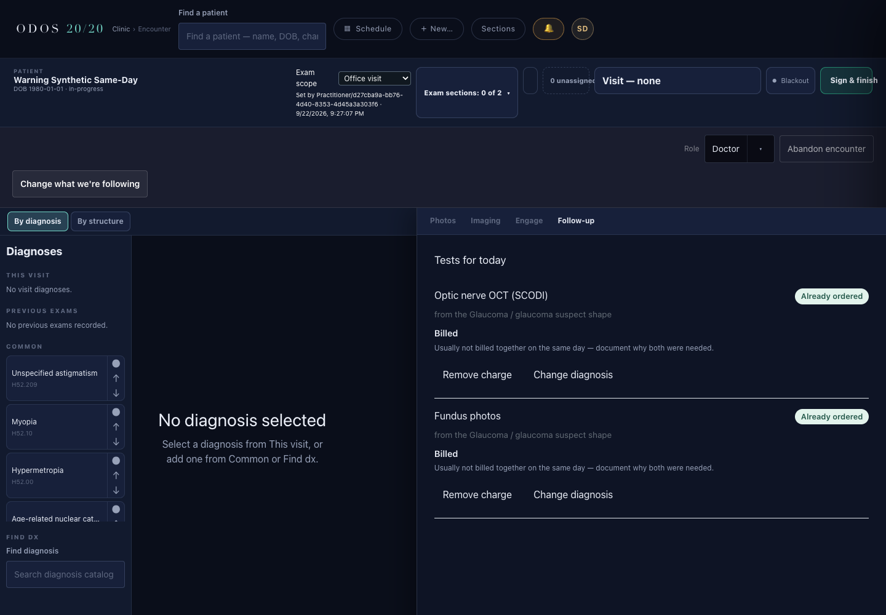
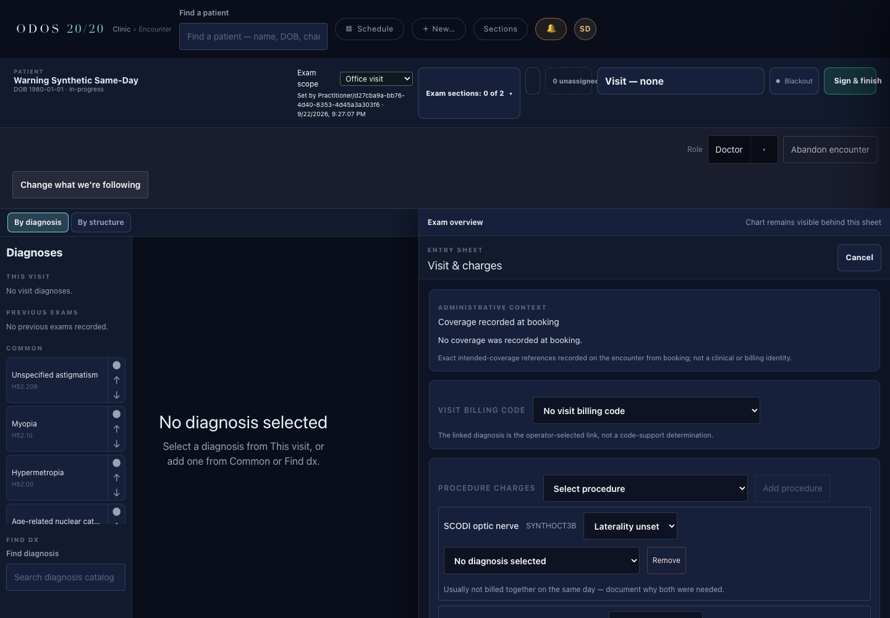
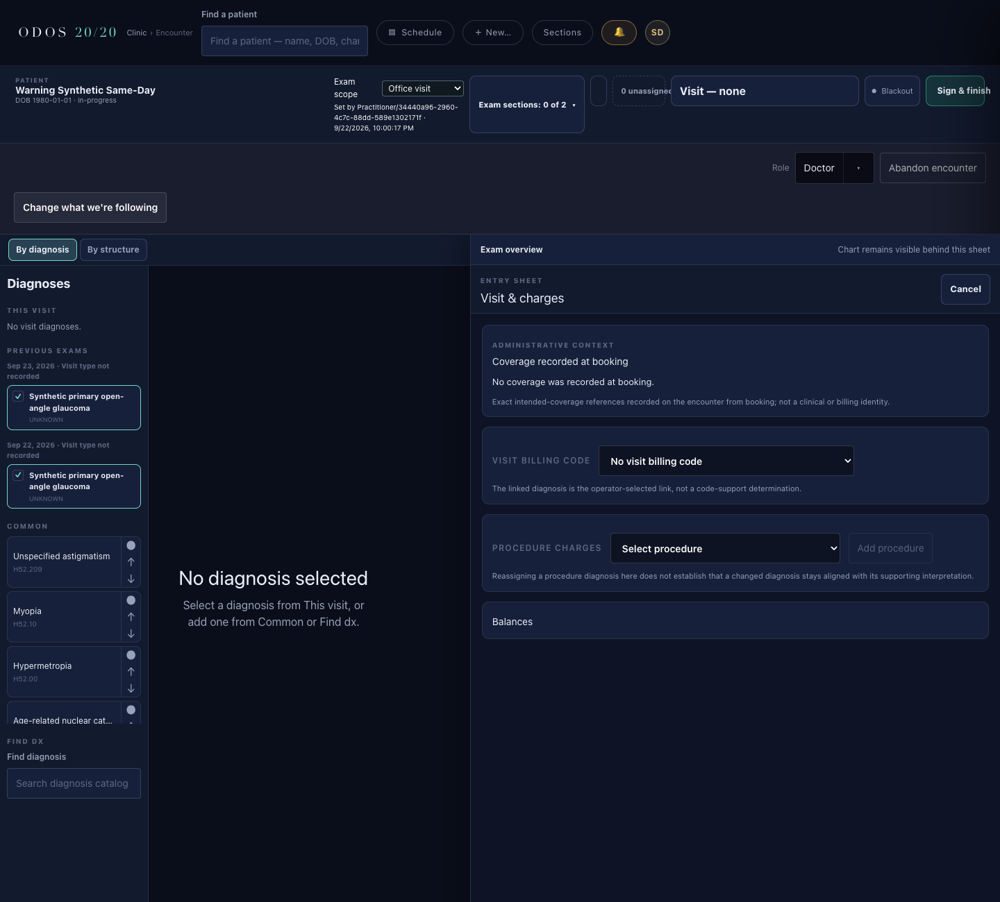
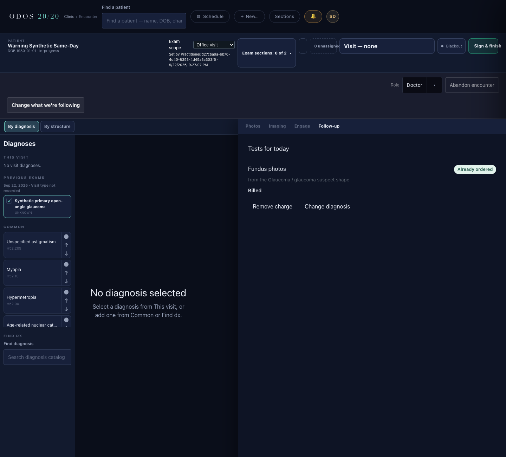
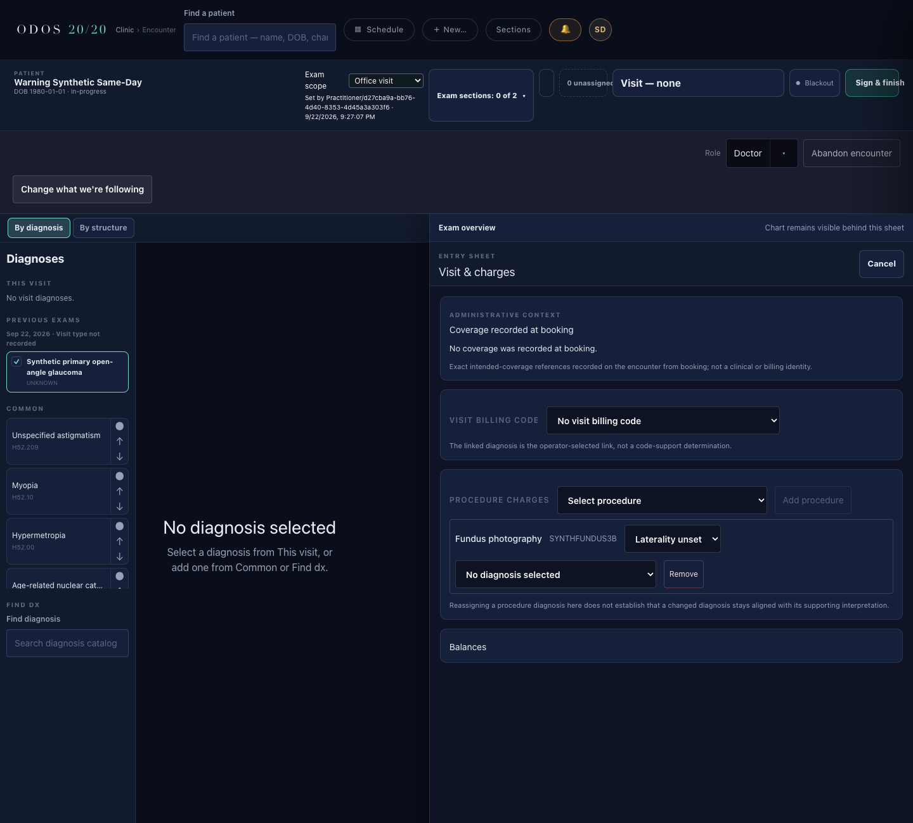

# Same-day OCT + photos warning — sealed build bundle

Status: needs-review. Author proof complete under R1–R3. NOT EVALUATED.

## Summary

Same-day OCT/photo warnings use image types across the patient's visits, with fields absent when no pair exists. Provider SCODI and fundus Accepts returned 200 and both Follow-up rows showed the exact warning; the reopened Visit panel showed both warnings. R3's single distinguishing check found neither newly accepted charge in the stale same-session panel, establishing the authorized pre-existing refresh-gap branch. The different-day photos-only control passed on both surfaces, including a visible accepted Visit charge. G1–G12, full suites, three typechecks, preflight, and all ordered live lanes retain their passing results. No product change was made under R1–R3. Independent evaluation remains outstanding; no merge is authorized.

## Identity and scope

- Branch: `drbang-iva/followup-s3c2c2b3b-same-day-warning`.
- Pinned base and freshly fetched origin/main: `fb94d75454ce96a52a828a6cacaeb10e57a1f7e2`. The published PR head identifies this bundle and its implementation together.
- Publication: PR to main on the named branch; PR URL and exact head accompany the final handoff. Author: Codex; independent evaluator remains Claude Opus 5.5. The kickoff requested gpt-5.6-sol/high; this runtime identifies its model family as GPT-6, so that requested alias is not asserted as the actual model.
- Open-PR scope sweep: #647 and #626 had no overlap with this slice's allowed changed files.
- Existing UI test files retain every original byte as their prefix; all additions are appended. Existing MCP tests are unchanged.
- No route, lock acquisition, transaction, or product write added. Routing caller count remains 59.
- `performance-od` was read-only. No new decision or INDEX update; no cross-repo implementation change.
- No new medical-code assertion or Mandate 14 ledger row. The supplied citation labels are carried verbatim in pair data.

## Files touched

- `mcp/src/clinical-graph/same-day-pairs.ts` (new)
- `mcp/src/clinical-graph/interpretation-gate.ts`
- `mcp/src/clinical-graph/follow-up-queue-endpoint.ts`
- `mcp/src/clinical-graph/manual-procedure-charge-endpoint.ts`
- `ui/src/lib/follow-up-queue.ts`
- `ui/src/lib/clinical-graph-client.ts`
- `ui/src/components/charting/FollowUpQueue.tsx`
- `ui/src/components/charting/ProcedureChargeList.tsx`
- `ui/src/styles/charting.css`
- `mcp/tests/sameDayWarning.test.ts` (new, 13 tests)
- `ui/tests/followUpQueue.test.tsx` (2 appended tests)
- `ui/tests/procedureCharges.test.tsx` (2 appended tests)
- This bundle and five synthetic screenshots (Follow-up pair, reopened Visit pair, R3 stale panel, and both different-day surfaces).

## P1–P6 re-verification

All premises were inspected through `git show origin/main:<file>` after `git fetch origin` confirmed the pinned SHA.

| Premise | Result at the pinned base |
|---|---|
| P1 | `FollowUpRowCharge` billed shape matches; `readQueue` filters proposals to the encounter; `rowCharge` returns accepted manual proposals as billed. `protocol-endpoint.ts:1327` returns a fresh queue after Accept. |
| P2 | `interpretation-gate.ts:41–42` prioritizes an image-type snapshot, then the live fee image type. |
| P3 | `annual-recall.ts:77,304–305` reads Encounter.period.start and extracts its written calendar prefix. |
| P4 | `manual-procedure-charge-endpoint.ts:103–141` returns options/diagnoses/proposals/attachedProcedures; ProcedureChargeList is 202 lines and uses procedureChargeApi. |
| P5 | ProtocolBasicStore.list parses all matching proposal Basics across encounters; ChargeProposal carries encounterId. |
| P6 | `procedure-charges.test.ts:414` compares the complete response; previous Follow-up assertions compare charge shapes. Conditional fields preserve those shapes; all existing suites passed unchanged. |

Source-parsing guards were read before editing, including clinicalGraphRouting, searchParamContract, FHIR read-grant preflight, and relevant stylesheet guards.

## G1–G12 mutation proof

Each mutation was temporary and restored before the green run. MCP runs used the dedicated Postgres container and ODOS_POSTGRES_URL. No existing assertion was changed. G12 intentionally breaks the existing gate's snapshot/live guard as explicitly required by the kickoff.

| Guard | Broken / red output | Restored / green output |
|---|---|---|
| G1 | `# tests 1; # pass 0; # fail 1; # skipped 0; exit=1` | `# tests 1; # pass 1; # fail 0; # skipped 0; exit=0` |
| G2 | `# tests 1; # pass 0; # fail 1; # skipped 0; exit=1` | `# tests 1; # pass 1; # fail 0; # skipped 0; exit=0` |
| G3 | `# tests 1; # pass 0; # fail 1; # skipped 0; exit=1` | `# tests 1; # pass 1; # fail 0; # skipped 0; exit=0` |
| G4 | `# tests 1; # pass 0; # fail 1; # skipped 0; exit=1` | `# tests 1; # pass 1; # fail 0; # skipped 0; exit=0` |
| G5 | `# tests 1; # pass 0; # fail 1; # skipped 0; exit=1` | `# tests 1; # pass 1; # fail 0; # skipped 0; exit=0` |
| G6 | `# tests 1; # pass 0; # fail 1; # skipped 0; exit=1` | `# tests 1; # pass 1; # fail 0; # skipped 0; exit=0` |
| G7 | `# tests 1; # pass 0; # fail 1; # skipped 0; exit=1` | `# tests 1; # pass 1; # fail 0; # skipped 0; exit=0` |
| G8 | `# tests 1; # pass 0; # fail 1; # skipped 0; exit=1` | `# tests 1; # pass 1; # fail 0; # skipped 0; exit=0` |
| G9 | `# tests 1; # pass 0; # fail 1; # skipped 0; exit=1` | `# tests 1; # pass 1; # fail 0; # skipped 0; exit=0` |
| G12 | `# tests 1; # pass 0; # fail 1; # skipped 0; exit=1` | `# tests 1; # pass 1; # fail 0; # skipped 0; exit=0` |
| G10-follow-up | `# tests 1; # pass 0; # fail 1; # skipped 0; exit=1` | `# tests 1; # pass 1; # fail 0; # skipped 0; exit=0` |
| G10-visit | `# tests 1; # pass 0; # fail 1; # skipped 0; exit=1` | `# tests 1; # pass 1; # fail 0; # skipped 0; exit=0` |
| G11 | `# tests 1; # pass 0; # fail 1; # skipped 0; exit=1` | `# tests 1; # pass 1; # fail 0; # skipped 0; exit=0` |

Breaks: G1 return no warnings; G2 restrict to the current encounter; G3 ignore service day; G4 remove patient query/filter; G5 use built-in concept keys; G6 include removed proposals; G7 refuse the queue read when a pair exists, making Accept fail; G8 always include an empty warning list; G9 convert to UTC; G10 remove each surface's warning line independently; G11 accept non-string warnings; G12 use only the live fee answer.

Commands: `node --import tsx --test --test-name-pattern='<named guard>' mcp/tests/sameDayWarning.test.ts`; G12 uses `mcp/tests/interpretationGate.test.ts`. UI guards run from ui with the corresponding `tests/followUpQueue.test.tsx` or `tests/procedureCharges.test.tsx` file. Every MCP command had ODOS_POSTGRES_URL pointing at the dedicated unit database.

The additional Visit-charges refresh test also failed before refresh was implemented and passed afterward. Focused restored coverage: MCP `104 pass / 0 fail / 0 skipped`; UI `43 pass / 0 fail / 0 skipped`.

## Proof 1 — suites and static checks

| Check | Base | After |
|---|---|---|
| MCP full CI roots | `tests 6329; pass 6274; fail 0; skipped 55` | `tests 6342; pass 6287; fail 0; skipped 55` |
| UI full suite | `tests 1859; pass 1859; fail 0; skipped 0` | `tests 1863; pass 1863; fail 0; skipped 0` |
| Script typecheck | exit 0 | exit 0 |
| MCP typecheck | exit 0 | exit 0 |
| UI typecheck | exit 0 | exit 0 |
| Preflight | exit 0 | exit 0 |

MCP: +13 tests. UI: +4 tests. Every baseline UI test name occurs in the after-run. The 55 uncredentialed MCP skips are not live proof; the credentialed lanes below ran separately without skips.

Commands:

- From mcp, with dedicated `ODOS_POSTGRES_URL`: `node --import tsx --test --test-concurrency=1 src/__tests__/**/*.test.ts tests/**/*.test.ts ../tests/boundaries/**/*.test.ts ../tests/observation-status-machine/**/*.test.ts ../tests/setup-wizard/**/*.test.ts ../tests/preflight/**/*.test.ts ../tests/smart/**/*.test.ts ../tests/cds/**/*.test.ts ../tests/agentops/**/*.test.ts ../tests/bulk-data/**/*.test.ts ../tests/mandate-8/**/*.test.ts`.
- Base UI: `npm --prefix ui test`. After UI: `npm --prefix ui test -- --test-name-pattern=S3c2c2b3b`; this argument was placed after the script's filenames and did not filter the run: all 1,863 tests executed, verified against all baseline test names.
- `npm run typecheck:scripts`; from mcp `npx tsc --noEmit`; from ui `npx tsc --noEmit --skipLibCheck`; `npm run preflight`; `git diff --check`.

Postgres: `odos-s3c2c2b3b-unit-db`, dedicated port 32787. `.odos/operator.env` and `.odos/operator-identity.json` were absent throughout all unit runs in this fresh worktree; neither required moving. They were generated only after the unit runs for the separate live lanes. No `.odos` file is committed.

After preflight: `FHIR read grant check: PASS (48 literal/marked resourceTypes)`; `FHIR operation grant coverage: PASS (952 read/write operations)`. The added operation is the caller-scoped Encounter read/search path; no write was added.

## Proof 2 — ordered live lanes

Fresh stack: `odos-s3c2c2b3b-live`; unique task-owned Postgres/Redis/Binary volumes. Server port 18103. MEDPLUM_BASE_URL is byte-identical to server baseUrl: `http://localhost:18103/`. Dedicated live ODOS_POSTGRES_URL uses port 15432. Healthcheck gate: **attempt 4**, every 2 seconds, maximum 90.

1. Smoke/bootstrap: `12 pass / 0 fail / 0 skipped`; integration: `218 pass / 0 fail / 0 skipped`; wrapper exit 0. Command: `npm --prefix mcp run test:live-integration`. Caller: synthetic contract admin before role repair.
2. `npm run operator-identity -- --project <runtime-project>`: exit 0. Caller: synthetic local project administrator; creates the privileged fixture seeder.
3. `GITHUB_ACTIONS=true npm run repair-practice-roles -- --email <synthetic-contract-admin> --project <runtime-project>`: exit 0; `Role policies created: 3 [provider, staff, admin]`; `Membership reconciliation: CHANGED`; `Roles granted: [staff, admin, provider]`; `Dev login primary role: staff`. GITHUB_ACTIONS was set only for this command.
4. `npm --prefix mcp run test:live-authz`: `78 pass / 0 fail / 0 skipped`; exit 0. Caller: repaired synthetic staff identity; fixture setup uses a distinct privileged seeder in the same runtime project. No flake rerun was needed.

## Proof 3 — setup and R1 history (resolved by R2/R3 below)

R1 authorized replacing the harness's invalid hyphenated codes. The corrected privileged synthetic fixture-seeder requests were:

```json
{"procedureConceptKey":"scodi-optic-nerve","billingCode":"SYNTHOCT3B","active":true,"priceCents":6000}
{"procedureConceptKey":"fundus-photography","billingCode":"SYNTHFUNDUS3B","active":true,"priceCents":6000}
```

Both writes succeeded (`setup exit=0`). Fee ids and versions were captured at runtime, then one synthetic patient and two visits on different service dates were created. Billing-code validation was not changed. The retained task stack restarted with a successful healthcheck on attempt 1; the original passing live lanes were retained under R1 and not rerun.

Chromium used the real `/clinic` route through the task's Vite and MCP processes. Caller: the repaired synthetic Practitioner with provider/staff/admin roles; its synthetic project membership has `admin: true`. The backend used a separate synthetic project-scoped runtime service after the launcher correction below. The browser reached Follow-up and clicked **Accept** on **Optic nerve OCT (SCODI)**. The captured POST response failed the unchanged assertion:

```text
AssertionError [ERR_ASSERTION]: Optic nerve OCT (SCODI) Accept must succeed
502 !== 200
actual: 502
expected: 200
operator: strictEqual
exit=1
```

**Rule 16 STOP.** No retry, no fundus Accept, no Visit-charges assertion, and no different-day control assertion ran after the failure. There are no completed warning screenshots. The original response body was not persisted and neither application log exposed an underlying exception; R2 below establishes the swallowed error and base control. The prior suite/live successes are not proof that this browser path works. No product fix was attempted.

Harness corrections, all confined to ignored files:

- Used the installed `docker-compose` executable because the host has no `docker compose` subcommand.
- Corrected an editing command's working directory before it touched any file.
- Replaced only the two setup code strings under R1.
- Supplied the documented local mode-0600 SMART signing key omitted from the launcher.
- Replaced the mistakenly selected fixture-seeder backend identity with a separate synthetic runtime service, following the existing served-browser harness. The seeder cannot read ProjectMembership for role resolution, so the first browser navigation could not open the chart and timed out before any Accept. The new runtime's project-scoped membership read returned HTTP 200; the browser caller's membership remained byte-identical. No caller policy or product file changed.

The latter startup corrections changed no Accept request, expected status, or warning assertion. The first product Accept failure was not treated as another harness error.

## R2 — ordered diagnosis and control (subsequent stop resolved by R3)

No product file changed during R2. The same retained synthetic stack restarted on 18103; healthcheck succeeded on attempt 1 (two-second interval, 90-attempt cap). The existing successful suites and ordered live lanes were not rerun.

### 1. Underlying error

The MCP log had no error lines for the failed Accept. Both the HTTP route and handler catch without logging. An ignored diagnostic harness invoked the unchanged `handleFollowUpAcceptRequest` directly, using fresh credentials for the **same Practitioner**, the same runtime service, the same patient/visit, and the original body:

```json
{"orderable":"scodi-optic-nerve","focus":"optic nerve"}
```

It used the production staff resolver and chart.write role selection. The resolved primary role and chart.write role were both `provider`; roles were `provider,staff,admin`. A harness-only Node inspector captured caught exceptions without editing the handler. The relevant exception and stack top were:

```text
Error: FHIR POST /fhir/R4/ServiceRequest [ServiceRequest] 403 Forbidden: Forbidden
    at toError (mcp/src/fhir-client.ts:318:19)
    at process.processTicksAndRejections (node:internal/process/task_queues:103:5)
    at async <anonymous> (mcp/src/fhir-client.ts:824:19)
    at async LiveOdosAuditRuntime.record (mcp/src/authz/liveAudit.ts:178:18)
    at async audited (mcp/src/fhir-client.ts:399:14)
    at async Object.materializeAction (mcp/src/clinical-graph/protocol-endpoint.ts:1005:21)
DIRECT HANDLER status=502
{"error":"The tests for this visit could not be loaded."}
```

The new Encounter read was not the failing operation in this reproduction. The inspector also observed an internal Node `Reader released` exception; the actionable rejected clinical operation above was ServiceRequest creation.

### 2. Partial writes

Privileged readback counted all matching SCODI plan-order actions and charge proposals, including removed states, and all ServiceRequests on the visit. The ServiceRequest result had no next page.

```text
After the original failed Accept, before direct invocation:
SCODI order actions = 0
ServiceRequests on visit = 0
SCODI charge proposals = 0

After the diagnostic direct invocation:
SCODI order actions = 0
ServiceRequests on visit = 0
SCODI charge proposals = 0
```

### 3. Base control

A new detached base worktree was created at `fb94d75454ce96a52a828a6cacaeb10e57a1f7e2`. Its `git status --porcelain` was empty. MCP was started from that clean checkout on the same task port, against the same retained stack, with the same runtime service. The same original Practitioner token and exact Accept body were sent to the real HTTP route for the same visit:

```text
Base HEAD: fb94d75454ce96a52a828a6cacaeb10e57a1f7e2
HTTP 502
{"error":"The tests for this visit could not be loaded."}
```

Thus this original failure predates the warning slice. The base control was an HTTP request; the detailed caught stack above is from the candidate's direct-handler reproduction.

### Provider continuation and new stop

The archived slice-2 bundle records a successful provider-role browser Accept. Its disposable checkout and private credentials are no longer present. The current stack received a new provider Practitioner using the existing served-browser pattern: `admin: false`, the one canonical single-role `ODOS Provider` policy, this synthetic patient compartment, and that Practitioner's profile parameter. The policy resource was read before/after and remained identical. The preserved visits were assigned to the provider in setup; their dates, fees, scope, and Accept bodies stayed unchanged. This recreates the prior provider-role setup; it does not claim reuse of the old stack's literal principal.

Harness-only setup corrections: the initial policy selector also matched the composite policy and stopped before creation; selection was corrected to require one role tag, as the live-authz helper does. A client-credentials role token could not enter the browser staff session, so it was not used for Accept. A first Practitioner invitation could not use the super-admin password endpoint (403). Inspection of the running local Medplum implementation confirmed that a new invitation accepts an initial password; a separate synthetic invitation used that supported field with `sendEmail:false`. Credentials stayed in ignored private files. No product, canonical policy, or original composite caller membership was changed.

After restarting MCP from the candidate worktree, Chromium results as the provider Practitioner were:

```text
SCODI Accept: HTTP 200; charge billed; warning absent before the pair
Fundus Accept: HTTP 200; both charges billed; both exact warnings present
Follow-up rendered warning count: 2
Visit charges panel: opened
Visit charges first warning visibility: timeout after 30000 ms
```



**Rule 16 STOP at Visit charges.** The successful Accepts were not repeated. A read-only new page navigation then returned procedure-charges HTTP 200 with two `sameDayWarnings`, two accepted proposals, and both messages in the Visit charges DOM. This narrowed the failure to the original post-Accept page state, consistent with the list loading on mount/encounter change without receiving a Follow-up mutation refresh. It does not erase the failed original click path or establish the precise fix.



The latter screenshot is after reopening; it is not a screenshot of the failed original state. Both messages were counted in DOM text; the second row extends below the captured viewport. Both screenshots were visually inspected and contain only synthetic data. At the R2 stop the different-day control remained unrun. R3 below resolves that stop and records the completed control. No product fix was made under R2 or R3.

## R3 — distinguishing check and completed different-day control

The prior screenshots did not capture the original stale panel's contents. One fresh page-session rerun was therefore made as authorized, using a new pair visit for the same synthetic patient on a distinct service date, the preserved coded fees, the same provider Practitioner, and unchanged Accept requests/assertions. The preserved photos-only control remained on its different service date. Retained-stack healthcheck: attempt 2, every two seconds, 90-attempt cap.

```text
SCODI Accept = HTTP 200
Fundus Accept = HTTP 200
Follow-up warning lines = 2, exact wording
Same-session Visit charges rows = 0
Same-session Visit warning lines = 0
Initial procedure-charges GET responses = HTTP 200, proposals 0, warnings 0
```



**R3 ruling: PROCEED.** Neither newly accepted charge appeared. This is the pre-existing cross-panel refresh gap specified by R3, independent of this warning slice. The previously recorded reopened GET and panel satisfy the Visit-charges pair proof. No product fix was made.

Different-day control, provider Practitioner, same patient, photos only:

```text
Photos Accept = HTTP 200
Follow-up charge = billed
Follow-up sameDayWarning field = absent
Follow-up visible warning lines = 0
Freshly loaded Visit procedure-charges GET = HTTP 200
Visit accepted charge rows = 1
Visit sameDayWarnings entries = 0
Visit visible warning lines = 0
```





Commands: `node .odos/same-day-proof/r3-browser.mjs` (one distinguishing check); `node .odos/same-day-proof/r3-control-followup.mjs`; `node .odos/same-day-proof/r3-control-visit.mjs`. Harnesses and credentials are ignored, not committed. All published screenshots were visually inspected.

The first transition to the control hit the synthetic server's 50,000-point FHIR quota: ProjectMembership GET returned 429 before the control Accept was issued. Read-only inspection showed the control remained for-review. Repeated role-service errors persisted because Medplum's in-memory limiter extends its block on blocked requests while backend workers keep reading. The task backend was paused for a full quota window, then restarted; the control completed without changing requests, assertions, quotas, policies, or product code. Separate page sessions with a cooldown were used for the successful Follow-up and Visit checks. A diagnostic print initially used fetch response `status()` instead of `status`; correcting that harness-only print changed no request or expectation.

The final allowed-file audit passed, both existing UI test files retain their exact base bytes as prefixes, and `git diff --check` passed. No new suite run was required by R1–R3 because no product or test code changed during those rulings.

## Cleanup

All task-owned containers are stopped, with their disposable volumes retained. Both task-owned application servers were stopped; ports 13333 and 15123 have no listeners. `vf-prac1b-walk-db` was left untouched.

`docker ps --format '{{.Names}}\t{{.Status}}\t{{.Ports}}'`:

```text
vf-prac1b-walk-db    Up 3 days    127.0.0.1:55481->5432/tcp
```

## Risks and follow-ups

- The pre-existing staff-profile Accept/ServiceRequest 403 and misleading generic 502 are tracked separately by the canonical R3 ruling.
- The pre-existing Visit panel does not refresh either charge rows or warnings after Follow-up mutations in the same page session. Reopening loads both correctly. R3 accepts this limitation; cross-panel refresh remains a follow-up.
- Independent Claude Opus 5.5 evaluation is still required. NOT EVALUATED. No tracked-file scope expansion or product change was made under R1–R3.
- Synthetic-stack FHIR quota exhaustion interrupted navigation; the successful control followed a backend cooldown, without changing quota settings.
- Eye/laterality not implemented: the warning ignores eye. Other pairs not implemented. Modifiers 59/XS not implemented. Q7 not implemented. Blocking not implemented.
- Warning searches are caller-scoped; they see only readable Encounters/proposals. Encounter pagination uses the existing bounded collector.
- The fee citation data uses the exact supplied citation labels; this slice does not assert or redistribute billing codes.
- No authz/policy/imaging/gate behavior change was used to make proof pass.

needs-review
