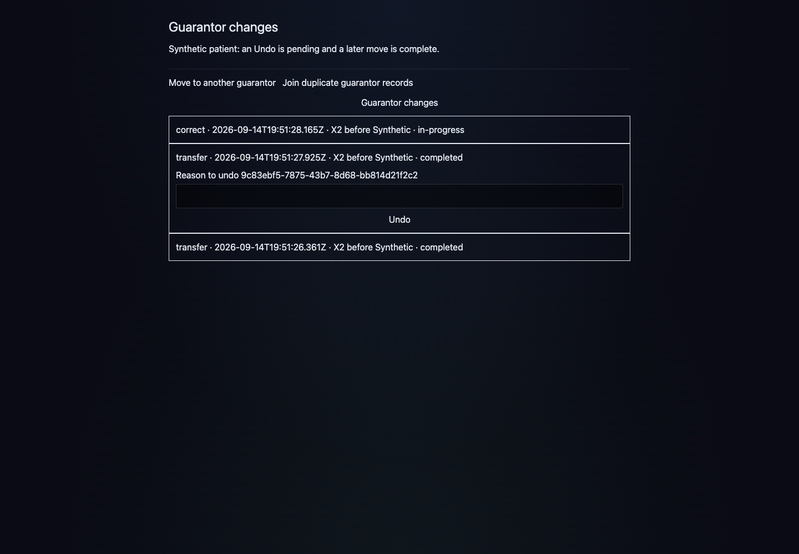

# G-2b-R author evidence — NOT EVALUATED

A lost server reply followed by an ordinary guarantor edit or a later move no longer strands a correction. New write intents record a phase-specific owned-field hash. Recovery uses that hash at the two existing classification sites; older intents retain the full-content fallback. Correct refuses a second correction already in progress, before any write. History suppresses Undo for originals with a trusted in-progress correction in the returned history page.

Branch: `drbang-iva/g2b-recovery`. Base: `bd7029eb55435655f3e4332b2cc703bfd2d77e7e`. Fresh `origin/main` was fetched in the task worktree and matched this base. The three premise paths had an empty diff. All four requested code anchors matched. PerformanceOD was read-only; the published ruling resolved through GitHub because the local companion checkout was behind it.

Source fingerprints in [source-sha256.json](source-sha256.json) bind these pre-commit executions to the implemented files. Live evidence records the base checkout SHA plus the actual source-file SHA-256 values; its `head` alone is not a claim that the unchanged base contains the repair. [verification.json](verification.json) confirms the live/mutation fingerprints, unchanged shipped tests, identical baseline/final failure names, and absence of fixture secrets in the evidence.

## Files and scope

- `mcp/src/clinic/guarantor-link-operation.ts`: exported pure projection/hash, optional intent hash, two classifier comparisons, correction admission, and the history flag.
- `ui/src/lib/guarantor-link-operations.ts`: optional history flag.
- `ui/src/components/patient/GuarantorLinkScreens.tsx`: hides the Undo reason and button when that flag is true.
- `mcp/tests/guarantorOwnedRecovery.test.ts`: ten new tests for R1–R6, legacy behavior, and inert corrections.
- `ui/tests/guarantorRecoveryHistory.test.tsx`: two new tests for Undo visibility.
- This directory: raw captures, regression output, mutation runner, live/browser proof runners, and this bundle.

Verification (5a), terminal transitions, definite-response disposition, create/draft claim admission, fences, S8 expressions, registration, and attach/unlink were not changed. Existing test bodies and `guarantorScreensFixture.ts` are byte-identical to the base. The helper was placed after `Operation` so the existing line-pinned service-write inventory remains unchanged. History derives its flag from the existing trusted page, preserving K13's single newest-50 query contract; admission separately searches all correction pages.

No new terminology codes or FHIR artifact URLs were introduced; Mandate 14 ledger rows: **0**. No new decision was made; `decisions/INDEX.md` and PerformanceOD were not changed. After merge, the contract owner must update the superseded full-content wording in the companion kickoff before proceeding with G-2b-2b.

## X1/X2 red before the repair

Command: `npm --prefix mcp test -- tests/guarantorOwnedRecovery.probe.ts`. The new tests initially used a `.probe.ts` name so the unchanged full baseline excluded them; they were later renamed to `.test.ts`.

[Raw red output](x1-x2-before.tap): `tests 2; pass 0; fail 2`. Both fail at `409 !== 200`.

| Schedule | Observed on unchanged engine |
|---|---|
| X1: correction detach committed, status-free reply loss, staff renamed D | Complete twice: `409 / interfered`; Correct C: `422`; owners `[]`; claim C retained; C `in-progress`. |
| X2: correction release committed, status-free reply loss, transfer B completed | Complete twice: `409 / interfered`; Correct C: `422`; owners `[D]`; no claim; A still `completed`; C `in-progress`. |

The fixture's existing `afterWrite` hook throws `new Error("reply lost")` after the target write has applied. Tests assert the unresolved journal intent and the post-loss owner/claim state before introducing the competitor.

## Mandate 17 controls

[mutations.json](mutations.json) records each exact replacement, verified mutant fingerprint, commands, failing test names, and restored fingerprint. Every control ran green → break → red → restore → green. No competitor was moved to another checkpoint to obtain a pass.

| Guard and failing test name | Deliberate break | Green / red / restored |
|---|---|---|
| R1 X1: lost correction detach followed by a staff rename completes with source ownership and no claim | Person intent comparison restored to full content | 1 pass / 1 fail / 1 pass |
| R2 X2: lost correction release followed by transfer B completes without rewriting B's child | Release intent comparison restored to full content | 1 pass / 1 fail / 1 pass |
| R3: a service competitor changing an unresolved Person link intent remains interfered | Drop `link` from owned projection | 1 pass / 1 fail / 1 pass |
| R4: an old journal without ownedHash retains full-content interference after a staff rename | Treat a missing hash as landed | 1 pass / 1 fail / 1 pass |
| R5: each phase hashes its owned fields and ignores non-owned changes | Drop `active` from link phases | 1 pass / 1 fail / 1 pass |
| R6: second Undo of completed original refuses without a write or a Task; second Undo of pending original refuses without a write or a Task | Remove correction admission | 2 pass / 2 fail / 2 pass |
| R6 UI: history hides Undo when correctionInProgress is true | Remove the Undo visibility condition | 2 pass / 1 fail, 1 pass / 2 pass |

R1's mutant retains the claim and reports interference. R2's mutant leaves A completed. R6's mutant makes **8 writes and creates a second correction Task** for each original status; the restored run makes zero writes and creates no Task. The same-operation-id retry still returns its existing correction. R3's shipped L13 claim-strip test also passes unchanged.

Raw per-control files are `<guard>-green.tap`, `<guard>-red.tap`, and `<guard>-restored.tap`.

Large captures and full-suite transcripts are stored losslessly as `.gz` files so the PR diff stays reviewable. Workstation prefixes in the published transcripts were replaced with repository-relative paths after capture; assertions, failure names, timing, and counts are unchanged. [evidence-archives.json](evidence-archives.json) records the sanitized uncompressed sizes and hashes; `gzip -dc <file.gz>` prints those bytes. Small red/green guard outputs remain directly readable. The original captures remain in the ignored local fixture directory. The mutation runner applies the same path sanitization to future output.

## Regression results

| Command / surface | Unchanged baseline | Final restored source |
|---|---:|---:|
| `npm --prefix mcp test` | 4,749 pass; 6 fail; 60 skip | 4,759 pass; same 6 fail; 60 skip |
| `npm --prefix ui test` | 1,519 pass; 0 fail | 1,521 pass; 0 fail |
| `guarantorLinkOperation` | 38/38 | 38/38 |
| `guarantorLinkRoutes` | 2/2 | 2/2 |
| `guarantorLinkPolicy` | 5/5 | 5/5 |
| `guarantorLinkAudit` | 5/5 | 5/5 |
| `guarantorLinkedReaders` | 2/2 | 2/2 |
| MCP `guarantorSearchScreens` | 17/17 | 17/17 |
| Six named backend files plus new recovery tests | — | 79/79 |
| UI search screens plus new history tests | 19 existing | 21/21 |
| `npm --prefix mcp run build` | — | exit 0 |
| `npm --prefix ui run build` | — | exit 0 |
| `npm run preflight` | 0 warnings; 0 hard blocks | 0 warnings; 0 hard blocks |
| Proxy census | — | 25 backend families; 28 entries; every family covered |

The six local MCP failures are five `claimReadModelStore` tests plus that file's teardown hook, all caused by `ECONNREFUSED 127.0.0.1:5433`. The 60 skips include 41 credential-gated live tests. The full local MCP command therefore exits 1; it is not represented as a green live-authorization suite. The separately configured synthetic live proof below is the policy/runtime evidence. CI at the PR's final head remains authoritative.

The initial fresh-worktree run also lacked root `tsx`; installing the locked root dependencies removed that failure. An intermediate preflight caught the helper shifting a line-pinned inventory entry; relocating only the new helper resolved it. An unrelated intermediate education API test returned 404 instead of 409, then passed in the final full run. These superseded diagnostics are retained in the ignored private fixture directory. No unrelated production code or existing test was repaired.

## Real-server and browser proof

Own compose project `g2br-live`, loopback Medplum `127.0.0.1:29080`, Postgres `29081`, Redis `29082`. Health: **5.1.30-9b1bd92**, pinned image digest recorded in [live-runtime.json](live-runtime.json). `transaction-bundles` is absent on all three synthetic projects. The real service identity and two authenticated non-admin memberships are recorded in [live-resource-state.json](live-resource-state.json) and [live-staff-auth.json](live-staff-auth.json). The staff rules match the shipped policy compiler after policy sync.

[Before](live-before.json.gz): 41 assertions, 100 engine transactions. [After](live-after.json.gz): 39 assertions, 125 engine transactions. **80 assertions total**, all matched. These are two bounded schedules per engine, not exhaustive concurrency coverage.

| Schedule | Real unchanged engine | Real repaired engine |
|---|---|---|
| X1 | Two Complete calls `409 / interfered`; owners `[]`; claim C retained | Complete `200 / linked`; C completed; owners `[S]`; no claim |
| X2 | Two Complete calls `409 / interfered`; A completed; C in-progress | Complete `200 / linked`; A cancelled; C completed; owners `[D]`; B's child version preserved; zero child write attempts after B |

Both cases use the actual registered HTTP routes with staff tokens. All FHIR traffic goes to the disposable server, through the actual service client and audit runtime. The loss is injected only after a successful committed target response, with no status on the thrown error. A fresh read must find exactly one unresolved intent and a moved target version. HTTP request/response sequences are in [live-before-http.json](live-before-http.json.gz) and [live-after-http.json](live-after-http.json.gz). The first harness attempt accidentally targeted a Task checkpoint; it was corrected to target the specified Person/RelatedPerson write before the accepted captures were run.

[Browser proof](browser-proof.json) mounts the actual `GuarantorLinkScreens` component, calls the real history route through Vite's existing proxy, and uses the **same persisted X2 state** in separate base/fixed worktrees. A remains completed and C remains in-progress in both captures. Before: two Undo controls. After: only B's Undo remains; A's Undo reason and button are absent. No API response is mocked. This proves the mounted history surface, not a whole patient-route walkthrough. Both captures have zero page errors and identical 1440×1000 dimensions.

Reproduction entrypoints: `live-proof.mjs fixture <action>`, `G2BR_PROOF_SOURCE=<unchanged-base-worktree> node --import tsx docs/build-log/guarantor-g2b-r/live-proof.mjs run before`, and the same command with `run after` using the task worktree. `browser-proof.mjs` takes `G2BR_BASE_ROOT=<unchanged-base-worktree>`. The fixture runner reuses the existing G-2b-1 helper with only isolated project/port/path substitutions; no shared fixture file is edited. Allow Medplum's login rate-limit window to clear between seed and credential refresh if necessary.

## Promise, residuals, and handoff

After a **lost release reply**, `completed` means the child was verified before release and this Task's claim is gone. “Released on exactly the verified version” is promised only when the release reply was received. Verification itself is unchanged.

Legacy intents without `ownedHash` deliberately keep the previous behavior, including their interference outcome. The ruling's residual Person `active` flip and raw-API claim-strip cases remain; neither has an ODOS screen. `active` policy fencing is a later policy slice. Simultaneous corrections are not made atomic by this read-before-create admission check. History is still the existing bounded page; the server admission check is authoritative even when a pending correction is outside that page.

CodeRabbit's atomic-admission finding is a valid residual, deferred to the contract owner: two requests can both search before either correction Task exists. The accepted ruling explicitly carries simultaneous corrections outside its executed matrix; this slice's R6 requirement is refusal when a trusted in-progress correction already exists. Reserving the original Task would add a write/reservation and recovery protocol beyond that bounded change. No atomic-admission guarantee is claimed. CodeRabbit's workstation-path findings were corrected in the published evidence. Its generic docstring warning is not adopted: repository style defaults to no comments unless the reason is non-obvious, and no behavior changed for that warning.

All three **own fixture containers were stopped, not removed**, with exit 0; see [fixture-final-state.txt](fixture-final-state.txt). Browser/proof servers were stopped and temporary browser fixture files removed. Other stacks were not changed. Worktrees and disposable fixture data are retained.

**NOT EVALUATED.** This is author evidence from Codex. The specified Claude adjudication session performs the independent evaluation; its contract-authorship independence limit remains disclosed in the ruling. No evaluator marker or operator override label was posted. No merge or deployment was performed. Final-head CI, CodeRabbit status, PR-Agent check-runs, and unresolved review threads are reported on the PR and in the final handoff.
