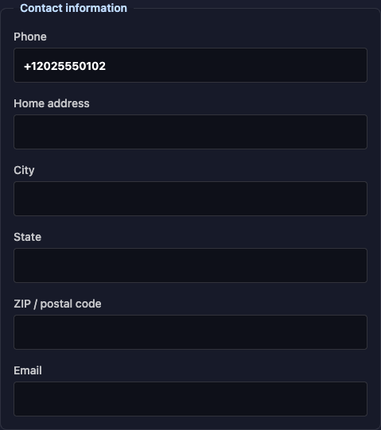
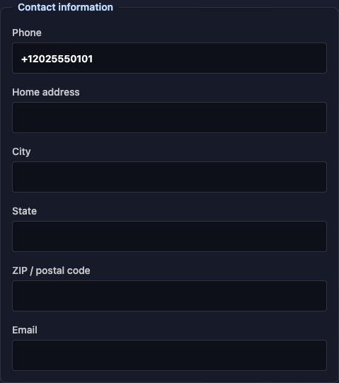

# SMS recipient integrity author evidence

Base: `21f7fc43b95f3927b374a5a4b711c01b8339d69a`. Reviewed head before this fixback: `c8d7229cf8e554954245c51c23cb77a486829df0`. The fixback source and this evidence are committed together.

NOT EVALUATED — the new fixback requires independent evaluation.

## Scope and search disposition

This fixback changes only `replacePreferredTelecom` in `ui/src/lib/patient-registration.ts`, G5 and G13 in `ui/tests/patientRegistration.test.tsx`, and this evidence file. Nonblank values replace only the displayed entry’s value in place, preserving system, use, rank, period, and position. Empty or whitespace-only values remove that displayed entry; all other entries remain untouched and in order. A missing blank contact appends nothing. New nonblank entries still use home.

The same helper rule applies to phone and email. `validatePatientDemographics` currently rejects empty and whitespace-only phones with `Phone number is required.`; clearing a phone cannot reach the normal save path today. Supplemental direct-helper checks prove blank removal for both systems, including fallback selection and missing entries.

G5 was added in this PR; its incorrect clearing expectation is now removal, while its nonblank metadata/order assertions remain. G13 drives the actual Email control and Save demographics action through the real FHIR client, intercepting only fetch. Both empty and whitespace-only input must serialize exactly `[work email, mobile phone]`, contain no empty `value` property anywhere in the raw PUT body, and preserve `If-Match: W/"3"`. The input Patient is unchanged.

The original PR changes four production files overall. Its display first-match rule, recipient overrides, registration endpoint, editor controls, preference/hold rules, and voice call site remain unchanged by this fixback. The earlier `rg -n "telecom" ui/src mcp/src` and indexing/home-reader search found no consumer requiring append-last or forced-home behavior; no additional consumer behavior was changed. No pre-existing baseline test expectation was rewritten.

Source SHA-256 at verification:

- `ui/src/lib/patient-registration.ts`: `dba4218de970d54ca880e7502f72dfd8b92b17ad276109583d54cec220472473`
- `ui/tests/patientRegistration.test.tsx`: `e2e6b57bd28fb0564bb64cc70feb25bd34d8a8c45afb458824618b09e4faf064`

## Inventory

All three stages were rerun for this fixback. API source declarations and runner totals differ because generated cases/subtests execute additional tests.

| File | Declarations: base → reviewed → fixback | Runner: base → reviewed → fixback | Final failures / skipped |
|---|---:|---:|---:|
| `mcp/tests/commsSuppression.test.ts` | 23 → 28 → 28 | 23 → 28 → 28 | 0 / 0 |
| `mcp/tests/commsApi.test.ts` | 68 → 72 → 72 | 87 → 91 → 91 | 0 / 0 |
| `mcp/tests/commsConfig.test.ts` | 25 → 27 → 27 | 25 → 27 → 27 | 0 / 0 |
| `ui/tests/patientRegistration.test.tsx` | 9 → 15 → 16 | 9 → 15 → 16 | 0 / 0 |
| `ui/tests/demographicsConcurrency.test.tsx` | 3 → 3 → 3 | 3 → 3 → 3 | 0 / 0 |
| `ui/tests/patientRegistrationEndpoint.test.tsx` | 4 → 4 → 4 | 4 → 4 → 4 | 0 / 0 |
| `ui/tests/registrationCommunicationPreferences.test.tsx` | 8 → 8 → 8 | 8 → 8 → 8 | 0 / 0 |

Seven-file runner totals: 159 at base; 176 at reviewed head; 177 after fixback. Every stage has zero failures, cancellations, and skips.

Commands: MCP files use `npm --prefix mcp test -- tests/<file>` individually. UI files use `cd ui && node --import tsx --test --test-reporter=tap --test-concurrency=1 tests/<file>` individually.

### Verbatim runner summary excerpts by file

`mcp/tests/commsSuppression.test.ts`

```text
BASE (exit 0)
# tests 23
# suites 0
# pass 23
# fail 0
# cancelled 0
# skipped 0
# todo 0
# duration_ms 178.789
REVIEWED HEAD (exit 0)
# tests 28
# suites 0
# pass 28
# fail 0
# cancelled 0
# skipped 0
# todo 0
# duration_ms 182.114542
FIXBACK (exit 0)
# tests 28
# suites 0
# pass 28
# fail 0
# cancelled 0
# skipped 0
# todo 0
# duration_ms 191.234334
```

`mcp/tests/commsApi.test.ts`

```text
BASE (exit 0)
# tests 87
# suites 0
# pass 87
# fail 0
# cancelled 0
# skipped 0
# todo 0
# duration_ms 520.890125
REVIEWED HEAD (exit 0)
# tests 91
# suites 0
# pass 91
# fail 0
# cancelled 0
# skipped 0
# todo 0
# duration_ms 592.545416
FIXBACK (exit 0)
# tests 91
# suites 0
# pass 91
# fail 0
# cancelled 0
# skipped 0
# todo 0
# duration_ms 577.166875
```

`mcp/tests/commsConfig.test.ts`

```text
BASE (exit 0)
# tests 25
# suites 0
# pass 25
# fail 0
# cancelled 0
# skipped 0
# todo 0
# duration_ms 373.586375
REVIEWED HEAD (exit 0)
# tests 27
# suites 0
# pass 27
# fail 0
# cancelled 0
# skipped 0
# todo 0
# duration_ms 369.82525
FIXBACK (exit 0)
# tests 27
# suites 0
# pass 27
# fail 0
# cancelled 0
# skipped 0
# todo 0
# duration_ms 392.086541
```

`ui/tests/patientRegistration.test.tsx`

```text
BASE (exit 0)
# tests 9
# suites 0
# pass 9
# fail 0
# cancelled 0
# skipped 0
# todo 0
# duration_ms 384.850958
REVIEWED HEAD (exit 0)
# tests 15
# suites 0
# pass 15
# fail 0
# cancelled 0
# skipped 0
# todo 0
# duration_ms 393.679542
FIXBACK (exit 0)
# tests 16
# suites 0
# pass 16
# fail 0
# cancelled 0
# skipped 0
# todo 0
# duration_ms 482.993875
```

`ui/tests/demographicsConcurrency.test.tsx`

```text
BASE (exit 0)
# tests 3
# suites 0
# pass 3
# fail 0
# cancelled 0
# skipped 0
# todo 0
# duration_ms 878.779958
REVIEWED HEAD (exit 0)
# tests 3
# suites 0
# pass 3
# fail 0
# cancelled 0
# skipped 0
# todo 0
# duration_ms 893.15975
FIXBACK (exit 0)
# tests 3
# suites 0
# pass 3
# fail 0
# cancelled 0
# skipped 0
# todo 0
# duration_ms 975.637541
```

`ui/tests/patientRegistrationEndpoint.test.tsx`

```text
BASE (exit 0)
# tests 4
# suites 0
# pass 4
# fail 0
# cancelled 0
# skipped 0
# todo 0
# duration_ms 347.880333
REVIEWED HEAD (exit 0)
# tests 4
# suites 0
# pass 4
# fail 0
# cancelled 0
# skipped 0
# todo 0
# duration_ms 335.5635
FIXBACK (exit 0)
# tests 4
# suites 0
# pass 4
# fail 0
# cancelled 0
# skipped 0
# todo 0
# duration_ms 441.284833
```

`ui/tests/registrationCommunicationPreferences.test.tsx`

```text
BASE (exit 0)
# tests 8
# suites 0
# pass 8
# fail 0
# cancelled 0
# skipped 0
# todo 0
# duration_ms 444.436042
REVIEWED HEAD (exit 0)
# tests 8
# suites 0
# pass 8
# fail 0
# cancelled 0
# skipped 0
# todo 0
# duration_ms 440.380916
FIXBACK (exit 0)
# tests 8
# suites 0
# pass 8
# fail 0
# cancelled 0
# skipped 0
# todo 0
# duration_ms 533.069084
```

## Mutation guards

Each guard first passed on the fixback source, failed with a verified written mutation, and passed again after byte-for-byte source restoration in the isolated mutation checkout. Mutations were never applied to the publishing branch. These are author checks.

| Guard | Deliberate break | RED | Restored GREEN |
|---|---|---|---|
| G1 | Unchanged mobile save; restore append-last/force-home | `G1-ui`: 1 test, 0 pass, 1 fail | `G1-ui`: 1 test, 1 pass, 0 fail |
| G2 | Changed mobile remains in place; relabel it home | `G2-ui`: 1 test, 0 pass, 1 fail | `G2-ui`: 1 test, 1 pass, 0 fail |
| G3 | Edit the displayed home; force index zero | `G3-ui`: 1 test, 0 pass, 1 fail | `G3-ui`: 1 test, 1 pass, 0 fail |
| G4 | Append a new home phone; append mobile instead | `G4-ui`: 1 test, 0 pass, 1 fail; `G4-exact`: 1 test, 0 pass, 1 fail | `G4-ui`: 1 test, 1 pass, 0 fail; `G4-exact`: 1 test, 1 pass, 0 fail |
| G5 | Nonblank email stays in place; blank removes displayed entry. Store blank / move email to end | `G5-ui`, `G5-email-only`: each 1 test, 0 pass, 1 fail | `G5-ui`, `G5-email-only`: each 1 test, 1 pass, 0 fail |
| G6 | Current home after expiry; loosen end boundary / restore education helper | `G6-resolver`: 1 test, 0 pass, 1 fail; `G6-education`: 1 test, 0 pass, 1 fail | `G6-resolver`: 1 test, 1 pass, 0 fail; `G6-education`: 1 test, 1 pass, 0 fail |
| G7 | Explicit SMS priority; prefer mobile | `G7-resolver`: 1 test, 0 pass, 1 fail; `G7-education`: 1 test, 0 pass, 1 fail | `G7-resolver`: 1 test, 1 pass, 0 fail; `G7-education`: 1 test, 1 pass, 0 fail |
| G8 | RelatedPerson current home; skip its period | `G8-education`: 1 test, 0 pass, 1 fail | `G8-education`: 1 test, 1 pass, 0 fail |
| G9 | Configured conversation parity; restore duplicated filter with mobile priority | `G9-config`: 1 test, 0 pass, 1 fail | `G9-config`: 1 test, 1 pass, 0 fail |
| G10 | Both wrapper errors; change each message | `G10-suppression`: 1 test, 0 pass, 1 fail; `G10-config`: 1 test, 0 pass, 1 fail | `G10-suppression`: 1 test, 1 pass, 0 fail; `G10-config`: 1 test, 1 pass, 0 fail |
| G11 | Voice wrapper selection; substitute old education selection | `G11-voice`: 1 test, 0 pass, 1 fail | `G11-voice`: 1 test, 1 pass, 0 fail |
| G12 | Duplicate homes first-match in place; restore old helper | `G12-ui`: 1 test, 0 pass, 1 fail | `G12-ui`: 1 test, 1 pass, 0 fail |
| G13 | Clear email through the editor and real serialized PUT; store blank instead | `G13-ui`: 1 test, 0 pass, 1 fail | `G13-ui`: 1 test, 1 pass, 0 fail |

G3 retains the supplied home-first case and adds home-at-index-1 so index-zero replacement is observable. G11 retains mobile/work and adds expired-mobile and explicit-SMS cases: the supplied mobile/work case alone cannot distinguish the old education rule. G4 uses exact value `555` directly against the transpiled production helper; the persisted editor guard uses `5550100` because phone validation is unchanged. G8 uses the existing route with a RelatedPerson reference and an email override; on SMS this leaves phone selection recorded without altering override parsing.

G5 was broken twice: storing the blank value and independently moving only the email to the end. G13’s storing-blank mutation fails on the raw serialized PUT-body assertion. Both changed tests also failed before the production fix was written, then passed after it. Additional resolver trimming/boundary and explicit-phone-override guards were rerun red/green.

Targeted command from the corresponding `ui` or `mcp` directory: `node --import tsx --test --test-reporter=tap --test-concurrency=1 --test-name-pattern=<guard> tests/<file>`.

### G5 and G13 before the production fix

`G5`

```text
PRE-FIX RED (exit 1)
not ok 1 - G5: the displayed home email changes in place or is removed when cleared without moving other entries
# tests 1
# pass 0
# fail 1
# cancelled 0
# skipped 0
# todo 0
POST-FIX GREEN (exit 0)
ok 1 - G5: the displayed home email changes in place or is removed when cleared without moving other entries
# tests 1
# pass 1
# fail 0
# cancelled 0
# skipped 0
# todo 0
```

`G13`

```text
PRE-FIX RED (exit 1)
not ok 1 - G13: clearing the email box removes only the displayed entry from the real serialized PUT
# tests 1
# pass 0
# fail 1
# cancelled 0
# skipped 0
# todo 0
POST-FIX GREEN (exit 0)
ok 1 - G13: clearing the email box removes only the displayed entry from the real serialized PUT
# tests 1
# pass 1
# fail 0
# cancelled 0
# skipped 0
# todo 0
```

### Verbatim targeted mutation runner excerpts

`G1-ui`

```text
RED (exit 1)
not ok 1 - G1: an unchanged demographics save keeps the mobile recipient and byte-identical telecom
# tests 1
# pass 0
# fail 1
# cancelled 0
# skipped 0
# todo 0
RESTORED GREEN (exit 0)
ok 1 - G1: an unchanged demographics save keeps the mobile recipient and byte-identical telecom
# tests 1
# pass 1
# fail 0
# cancelled 0
# skipped 0
# todo 0
```

`G2-ui`

```text
RED (exit 1)
not ok 1 - G2: a changed mobile value stays at its original position with metadata intact
# tests 1
# pass 0
# fail 1
# cancelled 0
# skipped 0
# todo 0
RESTORED GREEN (exit 0)
ok 1 - G2: a changed mobile value stays at its original position with metadata intact
# tests 1
# pass 1
# fail 0
# cancelled 0
# skipped 0
# todo 0
```

`G12-ui`

```text
RED (exit 1)
not ok 1 - G12: duplicate home entries keep the first displayed entry in place on unchanged and changed saves
# tests 1
# pass 0
# fail 1
# cancelled 0
# skipped 0
# todo 0
RESTORED GREEN (exit 0)
ok 1 - G12: duplicate home entries keep the first displayed entry in place on unchanged and changed saves
# tests 1
# pass 1
# fail 0
# cancelled 0
# skipped 0
# todo 0
```

`G5-ui`

```text
RED (exit 1)
not ok 1 - G5: the displayed home email changes in place or is removed when cleared without moving other entries
# tests 1
# pass 0
# fail 1
# cancelled 0
# skipped 0
# todo 0
RESTORED GREEN (exit 0)
ok 1 - G5: the displayed home email changes in place or is removed when cleared without moving other entries
# tests 1
# pass 1
# fail 0
# cancelled 0
# skipped 0
# todo 0
```

`G13-ui`

```text
RED (exit 1)
not ok 1 - G13: clearing the email box removes only the displayed entry from the real serialized PUT
# tests 1
# pass 0
# fail 1
# cancelled 0
# skipped 0
# todo 0
RESTORED GREEN (exit 0)
ok 1 - G13: clearing the email box removes only the displayed entry from the real serialized PUT
# tests 1
# pass 1
# fail 0
# cancelled 0
# skipped 0
# todo 0
```

`G3-ui`

```text
RED (exit 1)
not ok 1 - G3: the displayed home entry is updated in place even when it is not the first phone
# tests 1
# pass 0
# fail 1
# cancelled 0
# skipped 0
# todo 0
RESTORED GREEN (exit 0)
ok 1 - G3: the displayed home entry is updated in place even when it is not the first phone
# tests 1
# pass 1
# fail 0
# cancelled 0
# skipped 0
# todo 0
```

`G4-ui`

```text
RED (exit 1)
not ok 1 - G4: a missing phone appends exactly one home entry
# tests 1
# pass 0
# fail 1
# cancelled 0
# skipped 0
# todo 0
RESTORED GREEN (exit 0)
ok 1 - G4: a missing phone appends exactly one home entry
# tests 1
# pass 1
# fail 0
# cancelled 0
# skipped 0
# todo 0
```

`G6-resolver`

```text
RED (exit 1)
not ok 1 - G6: the shared SMS resolver skips an expired mobile for a current home
# tests 1
# pass 0
# fail 1
# cancelled 0
# skipped 0
# todo 0
RESTORED GREEN (exit 0)
ok 1 - G6: the shared SMS resolver skips an expired mobile for a current home
# tests 1
# pass 1
# fail 0
# cancelled 0
# skipped 0
# todo 0
```

`G6-education`

```text
RED (exit 1)
not ok 1 - G6: education records the current home instead of an expired mobile using the injected clock
# tests 1
# pass 0
# fail 1
# cancelled 0
# skipped 0
# todo 0
RESTORED GREEN (exit 0)
ok 1 - G6: education records the current home instead of an expired mobile using the injected clock
# tests 1
# pass 1
# fail 0
# cancelled 0
# skipped 0
# todo 0
```

`G7-resolver`

```text
RED (exit 1)
not ok 1 - G7: the shared SMS resolver prefers an explicit SMS entry over mobile
# tests 1
# pass 0
# fail 1
# cancelled 0
# skipped 0
# todo 0
RESTORED GREEN (exit 0)
ok 1 - G7: the shared SMS resolver prefers an explicit SMS entry over mobile
# tests 1
# pass 1
# fail 0
# cancelled 0
# skipped 0
# todo 0
```

`G7-education`

```text
RED (exit 1)
not ok 1 - G7: education records the explicit SMS entry instead of mobile
# tests 1
# pass 0
# fail 1
# cancelled 0
# skipped 0
# todo 0
RESTORED GREEN (exit 0)
ok 1 - G7: education records the explicit SMS entry instead of mobile
# tests 1
# pass 1
# fail 0
# cancelled 0
# skipped 0
# todo 0
```

`G8-education`

```text
RED (exit 1)
not ok 1 - G8: education records the RelatedPerson current home instead of an expired mobile
# tests 1
# pass 0
# fail 1
# cancelled 0
# skipped 0
# todo 0
RESTORED GREEN (exit 0)
ok 1 - G8: education records the RelatedPerson current home instead of an expired mobile
# tests 1
# pass 1
# fail 0
# cancelled 0
# skipped 0
# todo 0
```

`G9-config`

```text
RED (exit 1)
not ok 1 - G9: configured conversation lookup selects the same mobile, current home, and explicit SMS numbers
# tests 1
# pass 0
# fail 1
# cancelled 0
# skipped 0
# todo 0
RESTORED GREEN (exit 0)
ok 1 - G9: configured conversation lookup selects the same mobile, current home, and explicit SMS numbers
# tests 1
# pass 1
# fail 0
# cancelled 0
# skipped 0
# todo 0
```

`G10-suppression`

```text
RED (exit 1)
not ok 1 - G10: the suppression wrapper retains its no-active-phone error
# tests 1
# pass 0
# fail 1
# cancelled 0
# skipped 0
# todo 0
RESTORED GREEN (exit 0)
ok 1 - G10: the suppression wrapper retains its no-active-phone error
# tests 1
# pass 1
# fail 0
# cancelled 0
# skipped 0
# todo 0
```

`G10-config`

```text
RED (exit 1)
not ok 1 - G10: the conversation wrapper retains its no-active-phone error and reference fallback
# tests 1
# pass 0
# fail 1
# cancelled 0
# skipped 0
# todo 0
RESTORED GREEN (exit 0)
ok 1 - G10: the conversation wrapper retains its no-active-phone error and reference fallback
# tests 1
# pass 1
# fail 0
# cancelled 0
# skipped 0
# todo 0
```

`G11-voice`

```text
RED (exit 1)
not ok 1 - G11: voice retains mobile, active-period, and explicit-SMS selection through its wrapper
# tests 1
# pass 0
# fail 1
# cancelled 0
# skipped 0
# todo 0
RESTORED GREEN (exit 0)
ok 1 - G11: voice retains mobile, active-period, and explicit-SMS selection through its wrapper
# tests 1
# pass 1
# fail 0
# cancelled 0
# skipped 0
# todo 0
```

`additional-boundaries`

```text
RED (exit 1)
not ok 1 - SMS resolution retains active-period boundaries, trimming, and first-candidate fallback
# tests 1
# pass 0
# fail 1
# cancelled 0
# skipped 0
# todo 0
RESTORED GREEN (exit 0)
ok 1 - SMS resolution retains active-period boundaries, trimming, and first-candidate fallback
# tests 1
# pass 1
# fail 0
# cancelled 0
# skipped 0
# todo 0
```

`additional-override`

```text
RED (exit 1)
not ok 1 - education keeps an explicit phone override even when no active phone is recorded
# tests 1
# pass 0
# fail 1
# cancelled 0
# skipped 0
# todo 0
RESTORED GREEN (exit 0)
ok 1 - education keeps an explicit phone override even when no active phone is recorded
# tests 1
# pass 1
# fail 0
# cancelled 0
# skipped 0
# todo 0
```

`G5-email-only`

```text
RED (exit 1)
not ok 1 - G5: the displayed home email changes in place or is removed when cleared without moving other entries
# tests 1
# pass 0
# fail 1
# cancelled 0
# skipped 0
# todo 0
RESTORED GREEN (exit 0)
ok 1 - G5: the displayed home email changes in place or is removed when cleared without moving other entries
# tests 1
# pass 1
# fail 0
# cancelled 0
# skipped 0
# todo 0
```

`G4-exact`

```text
RED (exit 1)
not ok 1 - exact555
# tests 1
# pass 0
# fail 1
# cancelled 0
# skipped 0
# todo 0
RESTORED GREEN (exit 0)
ok 1 - exact555
# tests 1
# pass 1
# fail 0
# cancelled 0
# skipped 0
# todo 0
```

## Counterexamples and broader checks

The seven recipient counterexamples were rerun against the fixback source: unchanged mobile/work; duplicate homes; expired mobile/current home; explicit SMS priority; home only; RelatedPerson expiry; and configured-conversation parity.

```text
ok 1 - Step4(a): unchanged mobile/work retains order/use and MOBILE
ok 2 - Step4(b): two homes retain H1 first
ok 3 - Step4(c): expired mobile/current home agrees across general and education
ok 4 - Step4(d): explicit sms wins in general and education
ok 5 - Step4(e): home only resolves HOME
ok 6 - Step4(f): RelatedPerson expired/current resolves current home
ok 7 - Step4(g): config patientPhone equals shared resolver for a/c/d
# tests 7
# pass 7
# fail 0
# cancelled 0
# skipped 0
# todo 0
```

Supplemental direct-helper blank parity, base empty-email removal, and fixback empty-email removal each passed 1/1. The blank parity test includes missing entries and confirms current phone validation refuses blanks.

`npm --prefix ui test` (fresh fixback run, exit 0):

```text
# tests 1428
# suites 0
# pass 1428
# fail 0
# cancelled 0
# skipped 0
# todo 0
# duration_ms 215065.762
```

`cd mcp && node_modules/.bin/tsc --noEmit --pretty false`: exit 0, no diagnostics.

`npm --prefix ui run build`: exit 0; 317 modules transformed. The existing large-chunk warning remains.

Historical pre-fixback check retained for context: eleven related MCP files (persistence, conversation adapter, education actor/enrollment, and sequence execution/storage/timing) passed 183/183 before the reviewed head was evaluated. This broader MCP batch was not rerun for the UI-only fixback; the three requested MCP inventory files were rerun above.

## Browser evidence retained from the reviewed head

These existing screenshots and four browser scenarios were captured before this fixback at `c8d7229cf8e554954245c51c23cb77a486829df0`. G13 adds fresh editor/action/serialized-request proof as described above; no new browser screenshot is claimed.

The actual PatientDemographicsEditor rendered in a synthetic component fixture, using the same data and viewport against separate base/current Vite servers. Each save made exactly one conditional PUT and reopened the returned Patient. FHIR responses were intercepted; ancillary communications requests returned synthetic refusals. This is component/save-path proof, not a full authenticated app-route, AccessPolicy, Docker-stack, or message-delivery verdict.

G1: base changes `[mobile, work]` to `[work, home]`; current retains `[mobile, work]`. G12: base reopens the second home after an unchanged save; current reopens the first and retains both entries in order. Four browser scenarios passed.

| Base after unchanged save (G12) | Current after unchanged save (G12) |
|---|---|
|  |  |

## Limitations and follow-up

G13 uses the real component, action, and FHIR serialization with synthetic fetch responses. It proves request formation and If-Match propagation, not live server acceptance, authorization, or message delivery.

During initial G13 test setup, a composite input was selected instead of the host input, so the editor did not save. That setup failure is excluded from the guard evidence. After correcting the selector, G13 failed on the actual empty-value serialized request before the production fix and passed after it. No failures or skips occurred in the final inventory or full UI run.

Historical pre-fixback limitation: two intermediate API runs had `fetch failed` in different pre-existing tests; immediate repeats and three base diagnostic runs passed. Their socket cause remained unproven. All three fresh inventory stages above passed.

No terminology bindings, FHIR artifact URLs, regulatory citations, dependency renames, architecture decisions, or changes in other repositories were introduced. Public dependency identifiers and bot-authored metadata were left unchanged. Independent evaluation of this new head and bot review remain separate gates.
