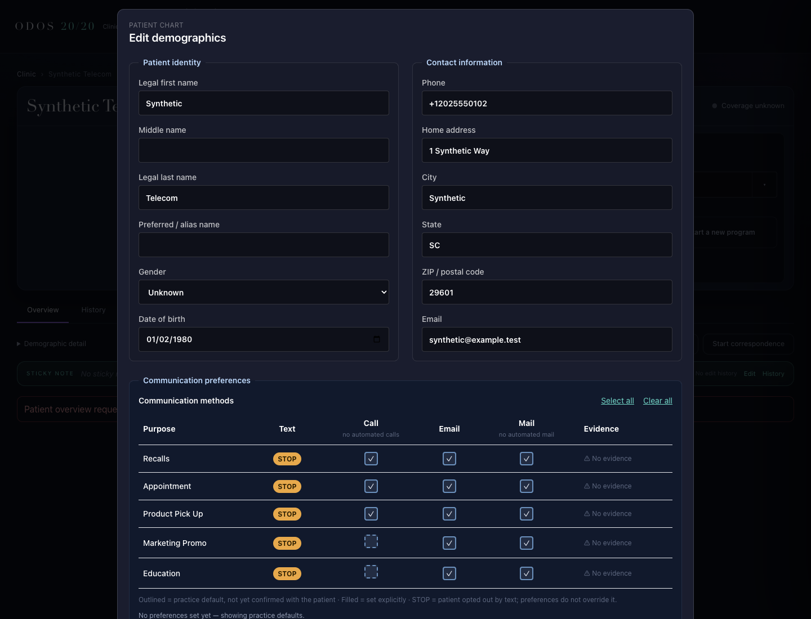
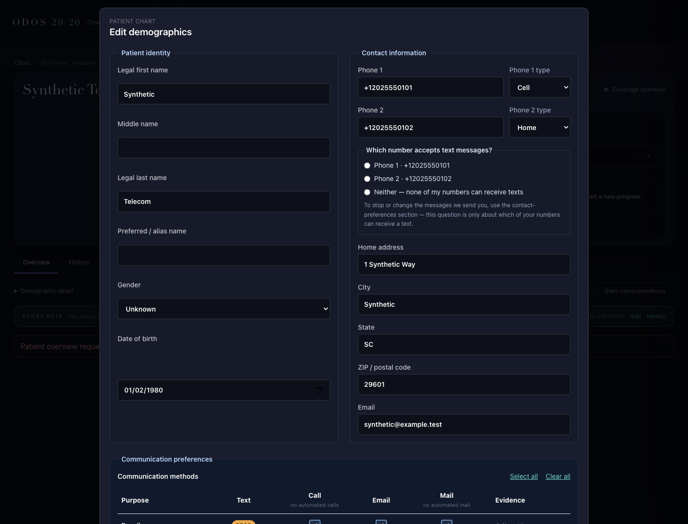

# Item 1b-ii — phone form and textable question

Status: **NOT EVALUATED — needs independent review.**

Base: `300462446fa2f908d4f614b2be7d0f371ef2794b`. Branch: `drbang-iva/phone-textable`.
Implementation checkpoints: `d066bd94` (editor caller), `8985a7656d23979cd8f576463fad5820209aed2c`
(registration caller), `ac39a410` (theme-variable correction). Regression-floor evidence was collected
against the registration checkpoint; all guard cycles and browser captures were refreshed after the
theme correction. These are author checks, not an independent verdict.

## Behavior and scope

The editor and New Patient form now show two optional phone slots with Cell/Home/Work types and
the exact textable question. The reader selects active entries in resolver order. Saves retain
original array identities and compare raw values to an immutable read-time snapshot. Untouched
whitespace, absent fields, legacy uses, periods, ranks, extensions, and entries outside the slots
survive. Only an edited or new phone value is trimmed. Email retains its existing trim/removal rule.

A changed phone answer leaves exactly one ContactPoint marker and removes Patient refusal.
Neither records one refusal while retaining ContactPoint markers. An unchanged answer preserves
the inherited marker state, including multiple markers. The original snapshot survives preference
refresh; a changed held slot causes the reload error before any PUT.

Registration requires the strict two-slot payload and textable answer, rejects the old scalar
payload, validates before MRN reservation, and omits blank phone entries. The same pure creation,
validation, and marker mechanics serve both callers. Guardian behavior is unchanged.

Application files:

- `ui/src/components/patient/PatientDemographicsEditor.tsx`
- `ui/src/lib/patient-registration.ts`
- `mcp/src/clinic/patient-registration-endpoint.ts`
- `mcp/src/clinic/patient-telecom.ts`

Tests: `ui/tests/patientPhoneForm.test.tsx`, `ui/tests/fixtures/patient-telecom.ts`,
`ui/tests/patientRegistration.test.tsx`, `ui/tests/patientRegistrationEndpoint.test.tsx`,
`ui/tests/registrationCommunicationPreferences.test.tsx`, and
`mcp/tests/patientRegistrationAuthz.test.ts`. Remaining additions under `item1bii-phone-form/`
are synthetic proof scripts, outputs, and captures.

## Regression floor

Each row ran as its own process with its own captured exit status. All have zero failed,
cancelled, and skipped tests. [Actual output tails](item1bii-phone-form/regression-output.txt)
and [commands/counts](item1bii-phone-form/regression-results.json) are retained.

| Suite | Passing tests | Exit |
|---|---:|---:|
| commsSuppression | 49 | 0 |
| commsApi | 99 | 0 |
| commsConfig | 32 | 0 |
| commsProfileBindings | 11 | 0 |
| wenoSwitchNewRx | 37 | 0 |
| ghlAdapter | 17 | 0 |
| patientRegistrationAuthz | 29 (26 original + 3 new) | 0 |
| patientRegistration | 20 | 0 |
| demographicsConcurrency | 3 | 0 |
| patientRegistrationEndpoint | 4 | 0 |
| registrationCommunicationPreferences | 8 | 0 |
| patientPhoneForm | 15 new | 0 |
| Full UI | 1,447 (1,432 original + 15 new) | 0 |

MCP command per row: `npm --prefix mcp test -- tests/<suite>.test.ts`.
UI command per row, from `ui/`: `node --import tsx --test tests/<suite>.test.tsx`.
Full UI: `npm --prefix ui test`. Both `npm --prefix mcp run build` and
`npm --prefix ui run build` exited 0. Vite retains its large-chunk warning.

CI's appearance guard caught six newly hardcoded color classes in the phone controls (16 total,
baseline 10). They now use existing theme variables. `npm run preflight` reproduced the initial
one-block failure and now reports **0 warnings, 0 hard blocks, exit 0**; the guard and its baseline
were not changed. The 18 form/concurrency tests and UI build were rerun after this correction.
[Correction evidence](item1bii-phone-form/style-preflight.json) and output are retained.

The accepted pre-change floor was patientRegistration 20, demographicsConcurrency 3,
patientRegistrationAuthz 26, and commsConfig 32, all exit 0. H10/J11 installer probes were not
rerun because no StructureDefinition changed.

[Byte comparisons](item1bii-phone-form/preservation-checks.json) confirm that
`suppression-gate.ts`, `demographicsConcurrency.test.tsx`, `responsiblePartySchema`,
`buildRelatedPerson`, the foreign-project reservation guard, and H14's email half are unchanged.
No If-Match assertion changed. The foreign-project refusal remains a passing original regression;
its pre-existing orphaned reservation is outside this slice.

## Every guard broken deliberately

Each cell below is the number of passing tests / failing tests / passing tests in the
green → mutation → restored sequence. Green and restored exit 0; every red exits 1.
No guard is decorative. Mutation anchors are checked for uniqueness, altered bytes are checked,
and source is restored in `finally` before the next guard.

| Guard | Deliberate fault | Green / red / restored |
|---|---|---:|
| K1 | Sort by array position instead of resolver priority | 1 / 1 / 1 |
| K2 | Trim untouched values | 1 / 1 / 1 |
| K2 absence | Substitute an empty snapshot value for absence | 1 / 1 / 1 |
| K3 | Emit a cleared slot with an empty value | 1 / 1 / 1 |
| K4 | Restore required-phone validation | 1 / 1 / 1 |
| K5 | Create a blank phone in the registration transaction | 1 / 1 / 1 |
| K6 | Set the new marker without clearing the others | 1 / 1 / 1 |
| K7 | Clear ContactPoint markers on Neither | 1 / 1 / 1 |
| K8 | Retain Patient refusal when choosing a phone | 1 / 1 / 1 |
| K9 | Clear inherited markers for an unanswered question | 1 / 1 / 1 |
| K10 | Hardcode new phone use to home | 1 / 1 / 1 |
| K11 | Ignore the type dropdown edit | 1 / 1 / 1 |
| K12 + H14 | Restore required-phone validation | 2 / 2 / 2 |
| K13 | Wire the rendered Phone 2 control to Phone 1 | 1 / 1 / 1 |
| K14 | Drop unrelated Patient extensions | 1 / 1 / 1 |
| K15 | Retake the snapshot during preference refresh | 1 / 1 / 1 |
| K16 | Skip the registration marker/refusal write | 1 / 1 / 1 |
| R2 | Permit an empty selected texting slot | 1 / 1 / 1 |

[Full TAP output for all 54 executions](item1bii-phone-form/guard-output.txt),
[structured results including mutation text and hashes](item1bii-phone-form/guard-results.json),
and the [replay script](item1bii-phone-form/mutations.py) are retained. K5 asserts the real parser's
`unrecognized_keys` issue and the real route's HTTP 400. The existing HTTP response projects issue
path/message rather than exposing the Zod code; that response shape is unchanged.

## Actual browser and persistence proof

Playwright opened the real `/clinic?patientId=…` route in base and proposed worktrees on separate
loopback ports. Both used the same synthetic Patient and a fresh, isolated Medplum 5.1.30 Docker
stack. Seven 1440 × 1100 captures were inspected. The application issued five Patient PUTs,
all HTTP 200 with the held version's If-Match header. Each was reread from Medplum and compared
to the serialized body. R2 caused zero PUTs. Browser page errors: 0.

| State | Observed result |
|---|---|
| Imported, no edit | Slots M/H; W retained in its original position; telecom unchanged |
| Choose Phone 2 (H), reload | H becomes first displayed slot; SMS H, voice M, history H; API returns H-thread |
| Neither, reload | H marker retained; SMS unavailable, voice M, history H; API still returns H-thread |
| Choose Phone 2 (M), reload | Refusal removed; SMS/voice/history M; H-only provider returns no thread |
| Blank phone, save/reload | No empty phone value; zero persisted phone entries |
| Choose blank Phone 1 | Exact R2 message at that slot; zero writes |

All [serialized PUT bodies, server readbacks, and conversation responses](item1bii-phone-form/browser/results.json)
are retained. The configured GHL adapter used a synthetic H-only provider response through the
real `/communications/conversations?provider=ghl&patientReference=…` API. No external message was sent.

| Before | After |
|---|---|
|  |  |

Additional captures: [H selected](item1bii-phone-form/browser/chosen-H.png),
[Neither](item1bii-phone-form/browser/neither.png), [M selected](item1bii-phone-form/browser/chosen-M.png),
[blank save](item1bii-phone-form/browser/blank-phone.png), [R2 block](item1bii-phone-form/browser/R2-block.png).

**Proof limit requiring acknowledgment:** this base and proposed UI have no conversation panel
or conversation API consumer. The requested screenshot of a panel retaining H-thread therefore
remains unavailable. The Neither screenshot and recorded real API response are separate evidence;
they do not claim a panel exists. No extra telecom UI was introduced to manufacture that capture.

Ancillary clinical endpoints were stubbed, and application staff/audit dependencies were injected.
Patient GET/PUT and preference reads used real Medplum. This is persistence and app-route proof,
not constrained-role AccessPolicy proof. The source registration suite exercises the real route
and transaction builder with its existing FHIR fake; it is not a live registration authorization test.

Replay from the task worktree after installing locked `ui/` and `mcp/` dependencies:

```sh
git worktree add --detach /tmp/odos-phone-textable-base 300462446fa2f908d4f614b2be7d0f371ef2794b
npm --prefix /tmp/odos-phone-textable-base/ui ci
node docs/build-log/item1bii-phone-form/setup-stack.mjs
node --import ./ui/node_modules/tsx/dist/loader.mjs docs/build-log/item1bii-phone-form/capture.ts
python3 docs/build-log/item1bii-phone-form/mutations.py
```

The setup uses `docker-compose`, a dedicated `odos-phone-textable` project, Medplum on
127.0.0.1:19313, unexposed Postgres/Redis, and generated credentials in gitignored
`.odos/phone-proof/`. Ports 15139/15140 must be free. `PHONE_BASE_ROOT`, `PHONE_STACK_DIR`, and
`PHONE_CAPTURE_DIR` override proof paths. Do not run mutation proof concurrently with application tests
or browser capture. Stop this task's containers with
`docker-compose -p odos-phone-textable -f .odos/phone-proof/compose.json down`.

## Follow-up and review boundary

> Known limit until item 1b-iv ships: the MCP update_patient tool (mcp/src/index.ts:5246-5255) and
> the legacy import merge (mcp/src/legacy-import/patient-import.ts:354-383) replace telecom
> wholesale and copy only system/value/use/rank. An agent-driven or import-driven telecom update
> after this form records a texting choice discards that choice and any period. 1b-iv makes both
> writers marker- and extension-preserving. Not in scope here.

No new decision, medical code, or canonical FHIR artifact was introduced; no decision index or
Mandate 14 ledger addition is required. This code records the existing verified marker definitions.
Independent evaluation must read the actual PR diff and these outputs at its final head. The author
has not posted an evaluation marker or applied an override label, and has not merged or deployed.
