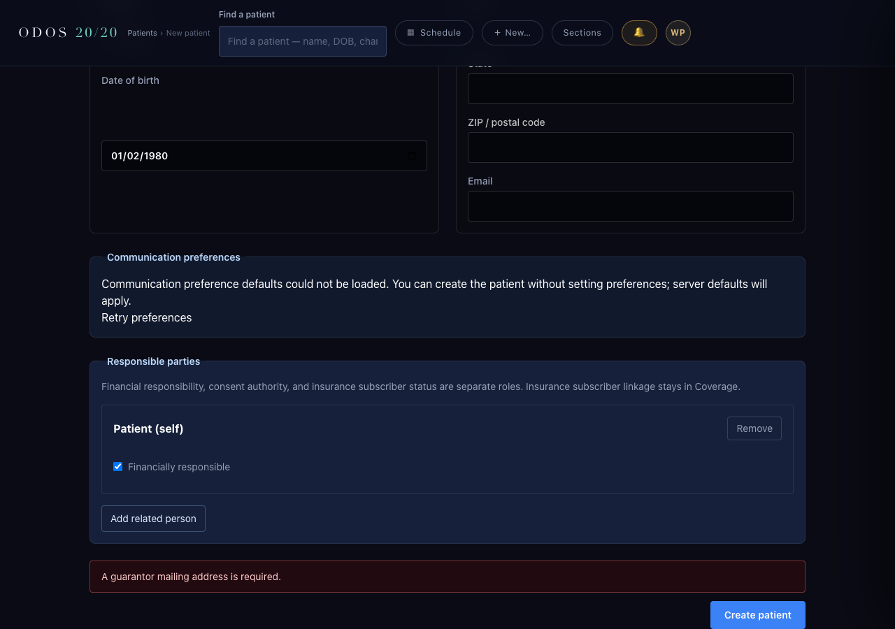

# Walkthrough W1 — A4 author bundle

**NOT EVALUATED.** Coded by Codex. Independent Claude Opus 5.5 (extra) evaluation is required before merge. This bundle records author-side proof only.

Base: `f21c44fa6affc9d6581b954c81577a9cf080f614`. Branch: `drbang-iva/walkthrough-w1-blockers`.

## Scope and B3 root cause

B1 passes the configured Postgres URL to both WENO search stores. B2 derives an entirely blank self-party mailing address from the patient's home address before validation and writing, and repeats registration errors immediately above Create patient. B3 distinguishes Accept write failures from queue load failures and logs the failing stage.

Accept passes on a fresh synthetic Medplum stack with current policies for both a provider-only caller and a composite admin + provider caller. No B3 product cause was reproduced and no root-cause fix is included. The Iris cause remains pending a separate post-deploy diagnosis using the new log line. No policy definitions or policy-sync code changed.

## Rerun

From a disposable checkout of this branch, with Node 22, Docker Compose (`docker-compose`), and Google Chrome available:

```sh
node docs/build-log/walkthrough-w1/w1-run.mjs
```

The runner installs missing locked dependencies, refuses a checkout containing a real `.env`, checks the required loopback ports, and creates an isolated `odos-w1-<random>` stack. Ports: Medplum 18103, Medplum Postgres 15432, dedicated non-default-password test Postgres 5433, MCP 3334, and browser preview 15173. It generates the database passwords, signing keys, super-admin, admin, humans, service client, and operator credentials at run time; none are committed.

The health gate polls every 2 seconds for up to 90 attempts. `MEDPLUM_BASE_URL` equals the server `baseUrl` byte for byte. The order is smoke + integration, operator identity and canonical role repair (`GITHUB_ACTIONS=true` only for repair), live authorization, then live route proofs. The test runner uses `MEDPLUM_CONTRACT_BOOTSTRAP=1`. Unit suites retain the dedicated W1 Postgres URL, with operator files moved aside and operator credential environment variables removed. UI suites use `npm --prefix ui test`.

G7 injects a failure only at the MCP process's outbound ServiceRequest POST to this synthetic server; all other reads, writes, authentication and AccessPolicy enforcement remain live. It observes the ordinary success assertion failing and checks the one failure log. G1 and G2 temporarily remove one configured WENO constructor argument. G6 temporarily collapses the write-error return into the load-error return. G3/G4 and G5 temporarily remove or subvert their corresponding guards. Source bytes are restored in `finally` blocks.

The browser screenshot exercises the served `/patient/new` route and real NewPatient component with an injected registration 400 and synthetic configuration responses; it proves error placement, not a live registration transaction. Registered-route tests separately prove B2 status, address persistence and zero writes on rejection.

The runner records summary-only evidence in ignored `.odos/w1-summary.json`, restores original operator files, stops its MCP process, removes its disposable stack and volumes, deletes generated credential files, and prints `docker ps`. It leaves unrelated containers, including the N0 history stack and VisionForge database, alone.

## Evidence

See [GUARDS.md](GUARDS.md) for mutation results, exact suite counts, earlier attempts, and cleanup.



## Files

| File | Purpose |
| --- | --- |
| `mcp/src/index.ts` | Configure the two WENO stores; no other index edits. |
| `mcp/src/clinic/patient-registration-endpoint.ts` | Derive the blank self mailing address before validation and transaction construction. |
| `ui/src/scenes/NewPatient.tsx` | Repeat the server error above Create patient. |
| `mcp/src/clinical-graph/protocol-endpoint.ts` | Preserve read failures; distinguish/log Accept write failures. |
| `mcp/tests/wenoIndexPostgresWiring.test.ts` | G2 constructor configuration guard. |
| `mcp/tests/walkthroughSelfRegistration.test.ts` | G3/G4 through registered clinic routes. |
| `mcp/tests/walkthroughFollowUpAcceptFailure.test.ts` | G6 through the actual index.ts route registration and real handler. |
| `ui/tests/walkthroughNewPatientError.test.tsx` | G5 real NewPatient scene, unchanged request/error expectation. |
| `docs/build-log/walkthrough-w1/w1-*.{mjs,ts}` | Portable synthetic bootstrap, live proof, persistence verification, fault injection and browser capture. |
| This log, guard summary and screenshot | Evaluator evidence; no credentials or full logs. |

## Premises and existing guards

P1–P5 were checked against pinned `f21c44fa`, not the restored working tree. P6 was re-swept at that commit. `followUpQueueEndpoint.test.ts`'s three load-body assertions cover load/Not today failures; the corresponding UI assertions cover load, decision and malformed-payload behavior. Registration A13 covers an existing Person. No additional existing assertion pins either changed behavior. No existing test file or assertion was changed. The Follow-up UI already displays `clinicalGraphResponseError`'s server message; no Follow-up UI edit is included.

## Rule 15 harness changes

- A1: retain exactly `invited.ok || invited.status === 409`. Before any Accept, assert one User, one project membership, a stored profile reference, and successful policy binding; assert provider access for both callers and admin status/access for the composite caller.
- Retain the accepted A1 setup: a separate synthetic super-admin for test-user password setup, a project-scoped runtime service, the diagnosis-derived exam overview, and persisted order/action/charge checks. Resolve the diagnosis code from the existing verified catalog/ledger rather than introducing a code literal.
- A2: generate every credential at runtime; collect the live success assertions and persistence checks in the one-command runner; use a narrowly scoped outbound-write injector for G7. Exercise G6 through the production route registration without changing its response or log assertions.
- Recover the exact original four product patches and four tests after the archived task's worktree disappeared during the initial read. Recreate and lock a checkout on the requested branch. Product edits match the accepted A2 scope.
- Correct the Docker bind mount location after `EISDIR` during startup: runtime config now lives in a private, gitignored worktree directory that Docker can mount. No product request had run.
- Supply the omitted `--email` argument to canonical role repair, matching CI. This was a setup-command failure before authorization or Accept.
- Export the generated operator credentials before live authorization, matching CI. The incomplete attempt reported 28 passing tests and seven fixture-seeder setup errors for missing `ODOS_OPERATOR_PROJECT_ID`; no authorization assertion was reached by those seven tests. Expected values, product requests and product files were not changed by this repair.
- A3: complete the pharmacy query with `searchType=local-retail` and use `q=latanoprost` for drugs, as explicitly authorized. Both expectations remain 200 → 500 → 200; mutate each constructor separately. The earlier incomplete pharmacy probe returned 400 and was not counted as a product failure or a passing guard.
- A4: append literal `all=true` to the pharmacy probe. `mcp/src/jobs/syncWenoPharmacyDirectory.ts:357–364` requires an additional filter; `mcp/src/weno/weno-search-routes.ts:1094–1100` accepts only literal true/false booleans. Keep the drug query `q=latanoprost` (`mcp/src/jobs/syncWenoDrugDatabase.ts:311` requires nonblank input). Expected statuses and response shapes are unchanged. Both prior incomplete pharmacy probes returned 400 and neither counts as a guard red.
- Correct my mistaken pharmacy class-name edit in the runner and new G2 AST fixture: the actual class is `PostgresWenoPharmacyDirectoryStorage`. The first A4 run passed both baseline probes, then stopped at the harness mutation-target assertion before a product mutation. Restore the exact class spelling and precheck all mutation target strings. No expectation or product code changed. An earlier setup run was also stopped, with its child process and disposable stack cleaned before restarting.
- Start Vite from the UI directory in the browser harness so Tailwind resolves its existing relative content globs. The first capture passed the route/alert assertions but lacked utility styling; recapture with the same synthetic input, request, and assertions. No application CSS changed.
- CodeRabbit cleanup fixback: isolate each cleanup operation so source restoration, MCP shutdown, stack removal, both original operator-file restores, evidence writes and credential deletion are attempted even if an earlier step fails. Report aggregated cleanup errors as a nonzero run. A seven-case fault test executes the actual finally block with synthetic operations; the old sequence gives 1 pass/6 failures, restored gives 7/7. No product or probe expectation changed.
- Move runnable harness sources out of `.odos/`; only ignored runtime output remains there. Relative imports are adjusted to the committed location. The final proof run uses the documented command from that location.

## Boundaries and follow-ups

No decisions or `decisions/INDEX.md` changes: PerformanceOD is read-only for this slice. No new Mandate 14 ledger rows: no new medical code or FHIR artifact URL is introduced; the synthetic visit reuses verified catalog data. No Iris mutation, deployment, merge, policy change or independent evaluation was performed.

Not done: Iris B3 diagnosis after deployment; session expiry; diagnosis-scope false concurrency warning; W2 and W3; top bar, Overview and same-day-tests design. Not today is unchanged.
