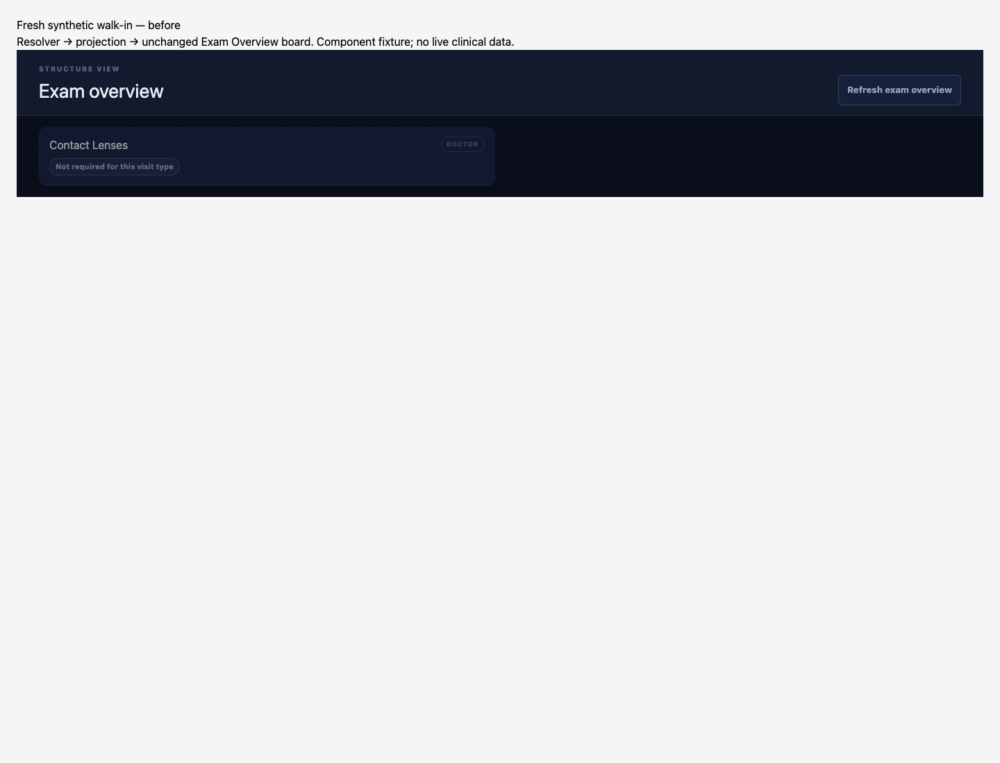
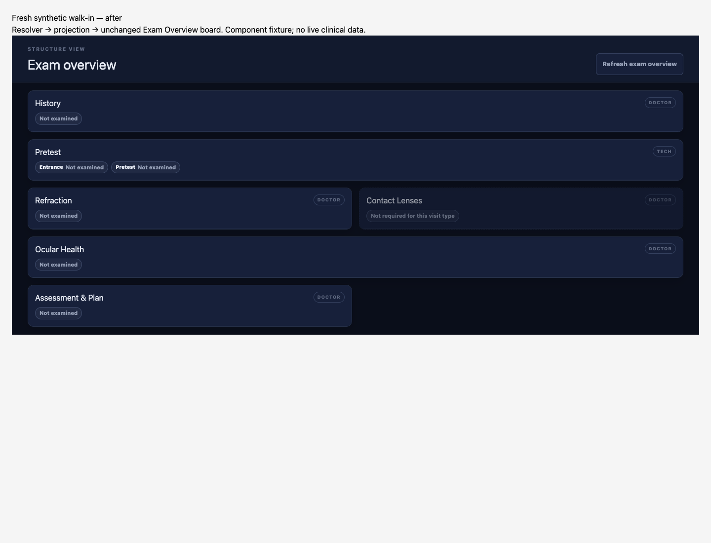

# VISITTYPE-1 — author evidence

Status: needs independent review; full MCP suite remains environment-blocked.
Branch: `drbang-iva/visit-type-resolver`.
Base: `63cda08d6e2779d36fd8378cf72f0995f5f8277e` (fetched origin/main before isolation).

## Change and gate

The resolver first searches every Encounter.type concept/coding for the existing
ODOS_VISIT_TYPE_SYSTEM and a category ID in the existing backend
DEFAULT_VISIT_TYPE_CATEGORIES (exams, contact-lens, medical). It returns the first
matching category. It does not infer a category from text, a foreign coding system,
an unknown code, or a catalog code.

Without a direct category it uses the original path unchanged: supplied Appointment,
otherwise Encounter.appointment[0] -> Appointment read -> appointment visit-type code
-> HealthcareService search -> HealthcareService category. Missing, malformed,
dangling, or uncategorized links still return undefined. Operational FHIR failures
still propagate. No default to exams. An encounter with no type and no appointment
still yields sections: [] and completeness.status: unconfigured.

Only the resolver implementation changes. The board, board filter, StartExam,
encounter bundle writer, policy registry, and concurrent examOverviewBoard.test.tsx
are untouched. Tests are in new mcp/tests/visitTypeResolver.test.ts and
ui/tests/visitTypeResolverBoard.test.tsx. This directory contains author evidence.

## Checks

Each command was run without an output pipeline; its process exit status was
captured separately. The MCP suite was not opted out of its live-stack gate.

| Command | Final output | Exit |
| --- | --- | --- |
| npm --prefix mcp test | tests 4385; pass 4322; fail 6; skipped 57 | 1 |
| npm --prefix ui test | tests 1305; pass 1305; fail 0; skipped 0 | 0 |
| npx tsc -p mcp/tsconfig.json --noEmit | no diagnostics | 0 |
| npx tsc -p ui/tsconfig.json --noEmit --skipLibCheck | no diagnostics | 0 |
| npm run typecheck:scripts | no diagnostics | 0 |
| npm run preflight | ODOS preflight complete: 0 warning(s), 0 hard block(s). | 0 |
| node --import tsx --test mcp/tests/visitTypeResolver.test.ts mcp/tests/findingSectionGroup.test.ts | tests 19; pass 19; fail 0 | 0 |
| git diff --check | no diagnostics | 0 |

Unchanged-base MCP: tests 4379; pass 4316; fail 6; skipped 57; exit 1.
Unchanged-base UI: tests 1304; pass 1304; fail 0; skipped 0; exit 0.
The six MCP failures are five tests plus the after-hook in
mcp/tests/claimReadModelStore.test.ts: connect ECONNREFUSED 127.0.0.1:5433.
The final failing test names match baseline. Of 57 skips, the harness explicitly
reports 41 live integration/authz skips because the live stack is unconfigured.
Neither run proves live authorization or deployed behavior.

## Mandate 17

Full verbatim command output and each exit status: [mandate-17.txt](mandate-17.txt).

1. Walk-in: removed the entire direct Encounter.type read/return block -> RED
   (1 test, 0 pass, 1 fail, exit 1); restored -> GREEN (1 test, 1 pass, 0 fail, exit 0).
   Asserts exams and all six required projection sections.
2. Scheduled: replaced the Appointment path category lookup return with undefined
   -> RED (1 test, 0 pass, 1 fail, exit 1); restored -> GREEN (1 test, 1 pass,
   0 fail, exit 0). Covers both absent Encounter.type and the scheduled catalog code.
3. Gate: defaulted the no-Appointment-reference branch to exams -> RED (1 test,
   0 pass, 1 fail, exit 1); restored -> GREEN (1 test, 1 pass, 0 fail, exit 0).
   Asserts undefined category, empty sections, and unconfigured status.
4. Board: removed the entire direct Encounter.type read/return block -> RED
   (1 test, 0 pass, 1 fail, exit 1); restored -> GREEN (1 test, 1 pass, 0 fail,
   exit 0). The real resolver feeds the real projection and unchanged React board.
   Asserts History, Pretest, Refraction, Ocular Health, Assessment, and zero finding rows.

Final production bytes were restored after each mutation.

## Component captures

| Before | After |
| --- | --- |
|  |  |

Synthetic component proof, not an authenticated application-route or deployed-box
walkthrough. The base resolver produced category=undefined, required=0; the changed
resolver produced category=exams, required=6. Both outputs were rendered through the
same unchanged board using React server rendering and captured in Chromium at
1440x1100. Visible board cards changed from 1 to 6. Entrance and Pretest share one
board card; optional Contact Lenses remains visible. No patient data or credentials.

## Report only — verified source findings

- Encounter.type is overloaded: ui/src/lib/encounter-bundles.ts:157 reads the
  Appointment serviceType coding, :181 passes it into the bundle, and :62-63 writes
  it to Encounter.type. mcp/src/fhir/schedulingVisitType.ts:225-228 defines catalog
  code routine-exam-new with category exams. Returning every matching code directly
  would break scheduled resolution. The existing category list prevents that;
  catalog codes continue through Appointment. No taxonomy or writer changes.
- mcp/src/clinical-graph/finding-section-group-endpoint.ts:91-97 uses this resolver
  to choose default finding groups. Encounters with explicit category IDs can now
  match default groups; this consumer was not changed.
- mcp/src/clinic/eye-exam-visit.ts:16-29 consumes the result before its catalog
  fallback. Synthetic comparison with direct exams and an empty catalog returned
  before=false, after=true. This affects the patient-overview eye-exams filter
  (mcp/src/clinic/patient-overview.ts:248) and annual-recall eye-exam classification
  (mcp/src/clinical-graph/annual-recall.ts:244); subsequent recall requirements still
  apply. Conflicting direct category versus Appointment now gives the direct category
  precedence. These consumers were not changed.

## Boundaries and follow-ups

Direct recognition intentionally uses the category IDs currently written by
StartExam. Practice-defined categories outside that list are not newly recognized
from Encounter.type. No policy was added for medical or contact-lens, so those
categories still have unconfigured completeness under the current registry.

No new medical terminology, FHIR URL, or regulatory claim: Mandate 14 ledger not
changed. No new architecture decision: companion decisions/INDEX.md not changed.
Cross-repo follow-up: none written; evaluator should assess the reported consumer
behavior before merge. Restore a disposable synthetic database/live stack for the
remaining full-suite proof, then obtain independent Fable/Opus evaluation at the
exact code head. This is author evidence, not an evaluation verdict.
